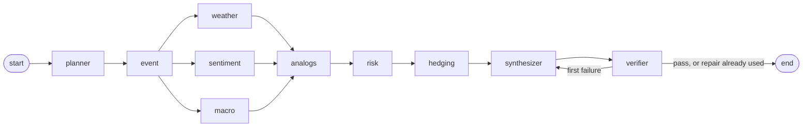
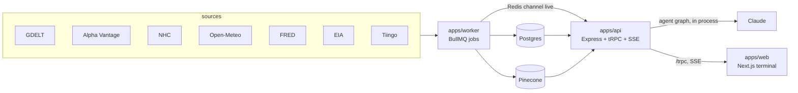

# Tempest

A financial intelligence terminal for a portfolio manager, built for Codeutsav problem statement 5 (`docs/PS5.md`).

Ask a question in plain English about anything that moves markets: a war, a tariff package, a competitor's refinery explosion, a Category 4 hurricane in the Gulf. A graph of specialised agents identifies the event, reads news, macro series, prices and (for storms) the storm track, retrieves similar past events from a vector index, maps how the event reaches each holding, computes portfolio risk, proposes hedges, and answers. **The model never writes a number.** Every figure in an answer is an evidence row computed or read by a node and linked to its source; a verifier rejects anything else.

Hurricanes are one event type among eight (geopolitical, policy, macro, statement, accident, disaster, corporate, supply shock). The weather agent runs only when the event is a storm.

## What is real and what is simulated

- Real: news (GDELT, Alpha Vantage), daily prices (Tiingo), macro series (FRED, EIA), storm tracks (NHC, HURDAT2), a Pinecone index of past events, the Claude models.
- Simulated: the portfolio is paper and fixed (23 positions, 95% invested). Hedges use ETFs in place of futures and nothing is sent to a broker. Replay mode uses the best track as a perfect forecast and says so. Prices are end-of-day. Hypothetical events and storms are labelled.
- Every read takes an as-of time. Replay mode cannot see anything dated after it (`docs/SPEC.md` 5.1; a test enforces it).

## Architecture



The graph has the same shape on every run; a node the question does not need ends `skipped`. A node that fails ends `degraded`, the run continues, and the answer names the gap and lowers its confidence.



| Path | What |
|---|---|
| `apps/api` | Express: `/trpc` (queries, mutations, SSE subscriptions), `/api` (REST), `/openapi.json`, `/docs` (Scalar), `/health`. Runs the agent graph in process. |
| `apps/worker` | BullMQ ingestion, enrichment and event detection. |
| `apps/web` | The terminal: live agent graph, event card, answer with evidence chips, hedge table, risk and forecast charts, storm map, Events / News / Sources tabs, drilldown, `/reliability`. |
| `packages/contracts` | Zod schemas, constants, formatters and fixtures shared by every package. Browser-safe. |
| `packages/agents` | The LangGraph graph, evidence ledger, verifier, fallbacks, prompts. |
| `packages/quant` | Pure maths: returns, betas, VaR, exposure channels, hedge sizing, kernel kNN forecast, backtest. No I/O, no clock. |
| `packages/services` | All I/O: Postgres, Redis, Pinecone, HTTP clients, the Anthropic client (`llm/`), runs. |
| `packages/trpc`, `packages/database` | Routes and Drizzle models. |
| `scripts` | Seed, backtest, eval, benchmarks, drills, `run-query`, `stream-run`. |
| `docs` | `SPEC.md` (what), `ROADMAP.md` (order and gates), `DECISIONS.md` (deviations), `PROGRESS.md`, `RESULTS.md` (measured numbers). |

## Quickstart

Requirements: Node 22, pnpm 9, Docker.

```sh
cp .env.example .env     # then fill in the keys (see the table below); .env is gitignored
./setup.sh               # links .env into every app and package
docker compose up -d     # Postgres 15 and Redis 7
pnpm install
pnpm db:migrate
pnpm seed                # prices, macro, storms, refineries, curated events, Pinecone index (idempotent)
pnpm dev                 # api on :8000, web on :3000, worker
```

Open <http://localhost:3000>, pick Replay, choose "Russia invades Ukraine" and ask the example question.

Without the seed or while a data source is down, `FAKE_SERVICES=1 pnpm dev` serves the agent graph from fixture data. It is for interface work and offline rehearsal, never for a demo.

Run one question from the terminal:

```sh
pnpm run-query --preset=geopolitical-russia-ukraine-2022 "How will the Russian invasion of Ukraine affect our portfolio?"
pnpm run-query --preset=disaster-hurricane-ida-2021 "How will the forecasted Category 4 hurricane in the Gulf of Mexico affect our current energy holdings?"
pnpm stream-run <runId>    # print a run's events; --drop-after=7 shows a reconnect with lastEventId
```

## Scripts

| Command | What |
|---|---|
| `pnpm check-types && pnpm lint && pnpm test && pnpm build` | The gate. CI runs it with Postgres and Redis. |
| `pnpm seed [--only=<step>] [--refresh]` | Load reference data. |
| `pnpm backtest` | Leave-one-out backtest of the combined forecast against type-only, news-only, regime-only, weather-only and unconditional baselines. |
| `pnpm eval` | The 20-query orchestration eval (`data/eval/queries.json`). |
| `pnpm bench:ingest` | Ingestion latency of the worker's real passes, upstream response received to Postgres and Pinecone writes acknowledged. |
| `pnpm drills` | Robustness drills with sources disabled. |
| `pnpm run-query`, `pnpm stream-run` | One run, and a run's event stream. |

## Environment

| Variable | Used by | Notes |
|---|---|---|
| `DATABASE_URL`, `REDIS_URL` | everything | Defaults match `docker-compose.yml`. |
| `ANTHROPIC_API_KEY`, `MODEL_REASONING`, `MODEL_FAST` | api, scripts | Sonnet for planner, hedging and synthesizer; Haiku for classification, notes and news scoring. |
| `PINECONE_API_KEY`, `PINECONE_INDEX` | api, worker, seed | Integrated-embedding index, created by the seed. |
| `TIINGO_API_KEY`, `FRED_API_KEY`, `EIA_API_KEY`, `ALPHAVANTAGE_API_KEY` | worker, seed | Free tiers; see `docs/SPEC.md` section 4 for limits. |
| `NOAA_USER_AGENT` | worker | NOAA asks for a contact address. |
| `DISABLE_SOURCES` | services | Comma list of sources forced offline, for the drills. |
| `PORT`, `BASE_URL`, `CORS_ORIGIN`, `DEMO_TOKEN` | api | When `DEMO_TOKEN` is set, `runs.create` and `system.ingestNow` need the `x-demo-token` header. Set it on anything reachable from the internet. |
| `FAKE_SERVICES` | api | `1` serves fixture data to the agents. |
| `NEXT_PUBLIC_API_URL` | web | Fixed at build time. |

Variables already exported in your shell win over `.env` (dotenv does not override them). If your shell sets `ANTHROPIC_API_KEY` or `ANTHROPIC_BASE_URL`, start the servers with `env -u ANTHROPIC_API_KEY -u ANTHROPIC_BASE_URL pnpm dev`.

Never commit `.env`, `data/cache/` or any Tiingo data; the licence forbids redistributing it.

## How an answer is made trustworthy

1. Nodes add evidence rows (`E1`, `E2`, ...) with value, unit, source, as-of time, basis (observed, computed, model, assumption) and the node that produced them.
2. The synthesizer writes text with placeholders such as `{{E12}}`. The server stores the template and the rendering. Digits outside placeholders are rejected.
3. The verifier checks that every placeholder exists, no digit escaped, every hedge action is inside the limits and cites evidence, only universe symbols appear, and every unavailable or stale input is named in a caveat.
4. A failed answer gets one repair. A second failure ships a deterministic template built from the structured data, and the run ends `partial`.
5. Confidence is computed from which inputs were available, never written by the model.

## Results

Measured numbers (backtest, eval, ingestion latency, drills, cost per run) are in [`docs/RESULTS.md`](docs/RESULTS.md). That file is written only from script output.
