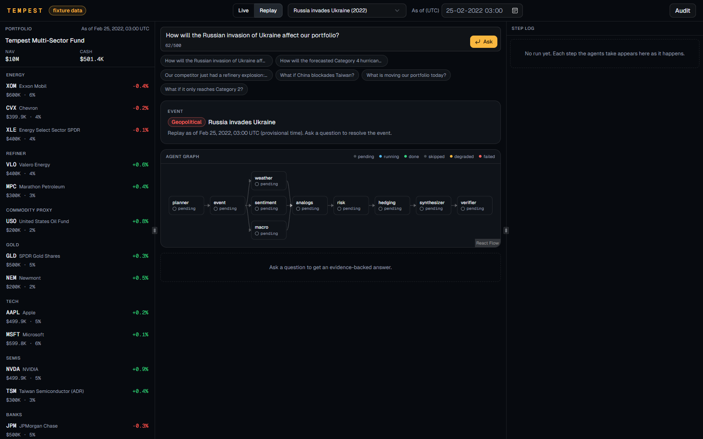
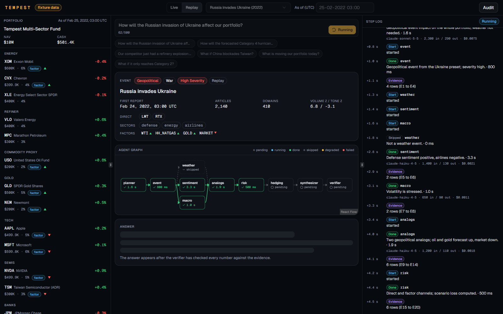
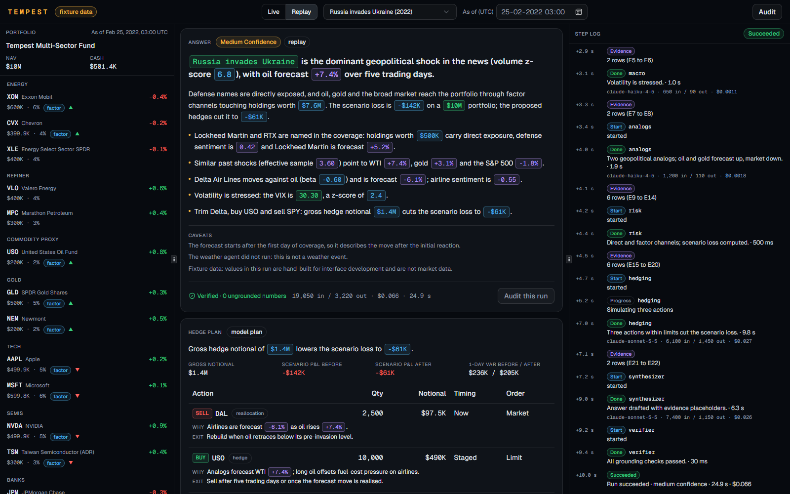
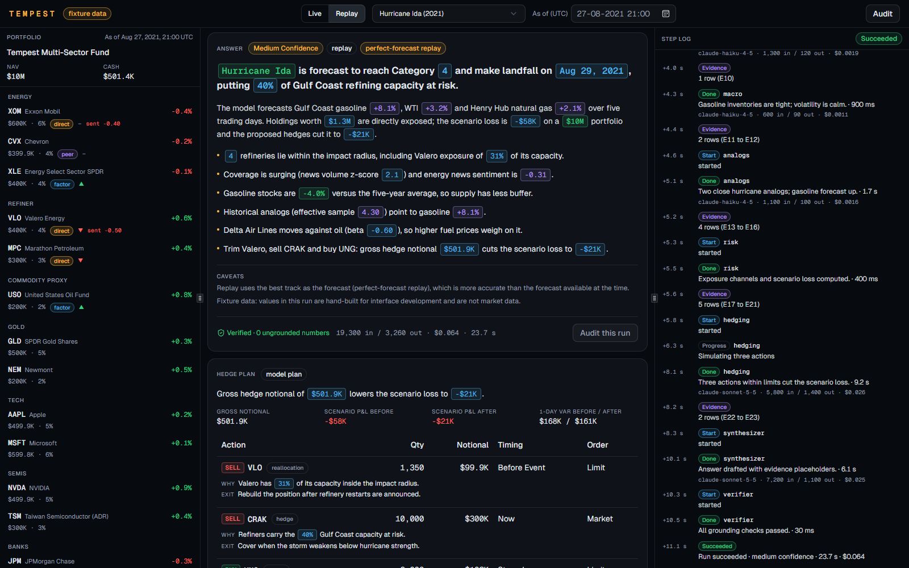
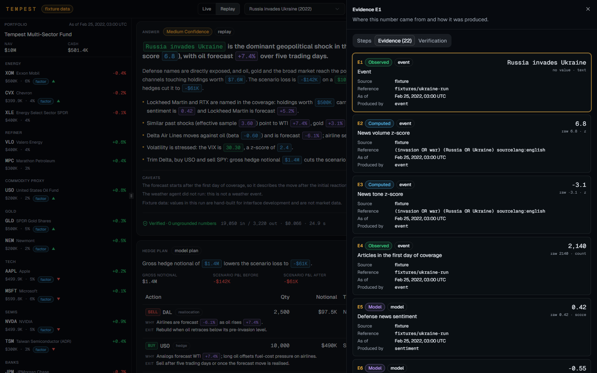
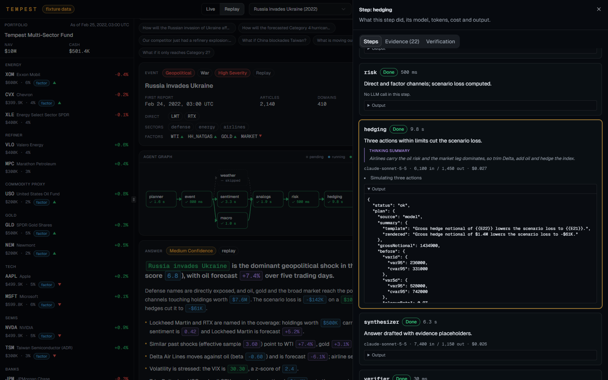
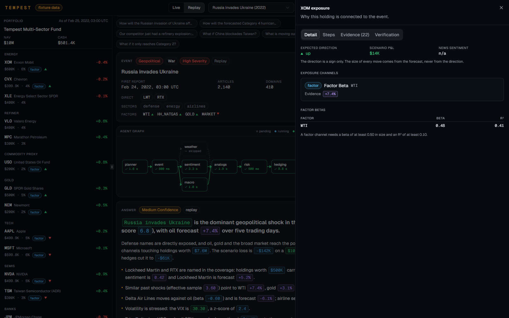
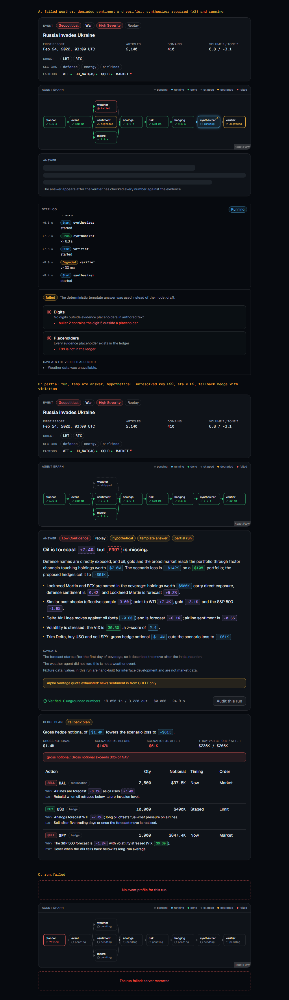

# Progress

Each track appends here at every merge point: what works, what is next, blockers.

## Phase 0: scaffold and contracts (2026-10-03)

Done by one contributor across all tracks.

**Works**
- `packages/contracts`: every schema and constant named in SPEC 5 to 8 and 11, `format.ts` (units, placeholder rendering, `barAvailableAt`), the Ida run fixture, and 41 passing tests.
- New packages and apps: `packages/quant`, `packages/agents` (empty shells), `apps/worker` (starts, logs, shuts down on SIGTERM).
- Dependency rules from SPEC 3 enforced by `no-restricted-imports` through `@repo/eslint-config/boundaries`. Checked by adding a forbidden import to `quant`, `contracts` and `web`: lint failed each time.
- `docker compose up -d`: Postgres and Redis both report healthy.
- `GET localhost:8000/health` returns 200; `/api/health` returns `{"status":"healthy"}`.
- `live.feed` streams a heartbeat every 5 s over SSE; the web page logs each one to the browser console.
- `pnpm check-types` (10 tasks), `pnpm test` (41 tests) and `pnpm build` (api, worker, web) are green.

**Gate (2026-10-03):** `pnpm check-types`, `pnpm lint`, `pnpm test` and `pnpm build` are all green. Template files (Google OAuth, user service, auth route, user model and migration, dead `.eslintrc.cjs`) are removed.

**Open**
- `components/ui/resizable.tsx` was updated for `react-resizable-panels` v4 (`Group`, `Separator`). The `aria-[orientation=...]` styles are untested until the terminal layout renders them.
- Root scripts `seed`, `backtest`, `eval`, `bench:ingest` and `drills` point at files that Phase 1 and 2 create.
- The first Drizzle migration is regenerated in Phase 1, Track A, once the models exist.

## Track A: Data

Entries at H7, H12 and H18.

### Interfaces (2026-10-03)

**Works**
- Drizzle models for all 17 SPEC 6 tables (`packages/database/models/`), with PKs, FKs, CHECKs and indexes; migration `0000_init`. Migrate on an empty database creates 17 tables and 19 CHECK constraints; a second migrate applies nothing, and a second `db:generate` reports no schema changes.
- Service classes with the SPEC 3 signatures (bodies throw "not implemented"): `market`, `macro`, `news`, `events`, `weather`, `analogs`, `portfolio`, `ingest`, `system` (plus `publishLive` and `subscribeLive` for the live relay), and `queues` (queue names and payload schemas are final).
- Verify-first checks 1 to 8, 12, 14 and 16 are recorded in DECISIONS (Track A). Check 13 is running (GDELT is slow and rate limits hard); check 15 sources are being collected.

**Requests for Track B**
1. `.env.example`: add `EIA_API_KEY=` (FRED has no weekly inventory series; `WGTSTUS1` and `WCESTUS1` come from the EIA API, see DECISIONS).
2. `packages/services/package.json`: add `"@repo/quant": "workspace:*"` (news features and detection call `quant/stats.ts` and `quant/detect.ts`, SPEC 5.9, 5.14).
3. `contracts` `SourceName`: add `"eia"` (additive), so the inventory source gets a health pill.
4. `REPLAY_PRESETS` (check 15, sources in DECISIONS and `data/seed/analog-events.json`), each `asOf` = `firstReportAt` + 24 h, `confirmed: true`:
   - `geopolitical-russia-ukraine-2022`: `2022-02-24T02:40:00.000Z`, asOf `2022-02-25T02:40:00.000Z`
   - `supply-opec-cut-2023`: `2023-04-02T13:57:00.000Z`, asOf `2023-04-03T13:57:00.000Z`
   - `policy-us-tariffs-2025`: `2025-04-02T20:06:00.000Z`, asOf `2025-04-03T20:06:00.000Z`
   - `corporate-svb-2023`: `2023-03-08T21:06:00.000Z`, asOf `2023-03-09T21:06:00.000Z`
   - `accident-boeing-door-2024`: `2024-01-06T01:12:33.000Z`, asOf `2024-01-07T01:12:33.000Z`
   - `disaster-hurricane-ida-2021`: unchanged.

### Phase 1 progress (2026-10-03, 16:15 IST)

**Works**
- `clients/http.ts` (SPEC 5.3) with 16 fake-fetch tests; clients `tiingo`, `fred`, `eia`, `gdelt`, `alphavantage`, `nhc` (CurrentStorms and MapServer forecast points), `openmeteo`, `hurdat2`, `pinecone`, `redis`, each with a recorded fixture in `data/fixtures/` and a parse test.
- Seed steps 1 to 4 and the Pinecone index check (`pnpm seed`, `--only=`, `--refresh`): 41 instruments, 23 positions (weights 0.95), 120,905 price bars (37 Tiingo symbols to 2026-10-02 plus 4 FRED factors), 14,370 macro observations, 202 storms and 6,223 points (2015 to 2025), 127 refineries (PADD 3 10.32 M bpd). Seeding twice leaves every table hash unchanged.
- `data/seed/analog-events.json`: 36 sourced events, validated by `packages/services/analogs/curated-events.test.ts`.

### GATE A (2026-10-03)

**Passes.** `pnpm exec dotenv -- tsx scripts/seed/gate-a.ts` prints PASS for every check:
- Seeding twice changes nothing (identical content hashes of `price_bars`, `macro_observations`, `storm_points`, `refineries`, instruments and positions); counts printed by `pnpm seed`.
- Every Tiingo symbol has bars from 2015-01-02 (CRAK 2015-08-19, JETS 2015-04-30, their launches) to the last close, 2026-10-02.
- The SPEC 5.1 as-of test (`packages/services/as-of.test.ts`) passes at the Ida and Ukraine as-ofs for `market.bars`, `closesAt`, `returns`, `adv`, `macro.series` and `macro.latest`.
- `market.returns` for all 41 universe symbols returns 504 aligned rows at both as-ofs (Ida: 2019-08-16 to 2021-08-27; Ukraine: 2020-02-11 to 2022-02-24).
- `data/seed/analog-events.json` validates against `CuratedEventSeed`; all 36 events have a source URL.
- Also done: news prefilter (`services/news/prefilter.ts`, 9 tests); `macro.snapshot` works at both as-ofs (Ukraine: VIX 30.32, stressed, z 2.79; crude stocks 9.6% below the 5-year average).

**Team data cache:** `data/cache/tempest-data-cache-2026-10-03.zip` (6.3 MB: Tiingo, FRED, EIA, HURDAT2, EIA refineries). Unzip into `data/cache/`, then `pnpm seed` uses no API quota. Shared inside the team only (Tiingo licence).

### Phase 2 progress (2026-10-03, 17:20 IST)

**Works**
- `weather`: `stormsAt`, `track` (observed + perfect-forecast replay for HURDAT2, latest NHC advisory live, persistence fallback), `hypotheticalTrack` (SPEC 5.12), `refineries`, `hubForecasts`; at-risk refineries within 100 km of 64 kt points at 1-hour steps. At the Ida as-of: 6 observed points, 14 forecast points to 2021-08-30 18:00 labelled `perfect_forecast_replay`, 9 refineries at risk.
- `portfolio.snapshot`: demo portfolio at the Ukraine as-of, 23 positions, cash $501,501 (5%).
- `analogs`: `search` (Pinecone filter + Postgres re-check), `get`, `list`, `presetEvent` (pre-outcome fields only).
- `news`: `upsertBatch` (SPEC 5.2: dedupe, prefilter, parallel Postgres and Pinecone writes, `indexed_at`), `search`, `list`, `typeCounts`.
- Routes `portfolio.get`, `market.instruments`, `market.bars`, `news.list`, `weather.storms`, `weather.track`, `weather.refineries`, `macro.snapshot`, `analogs.list`, each checked with curl against the seeded database.
- Seed step 5 (`pnpm seed --only=analogs`) with Track C's builders: hurricanes 2017 onward from HURDAT2 and the 36 curated events, into `analog_events` and Pinecone `events`.
- GATE A2 checks covered by tests: Ida track (observed + 72 h labelled forecast); news search at the Ukraine as-of returns only items in the 72 h window; analogs search never returns the replayed or a later event.

**Blocked or waiting**
- GDELT: still refuses most requests from this machine at 1 request per 5 s (end to start); seed step 5 cached 2 of about 100 timelines in 25 minutes. Workaround: anyone on another network runs `pnpm seed --only=analogs` (cached timelines land in `data/cache/gdelt/timeline/`) and zips that folder for the team; events without timelines are seeded with null news features and listed in the log. Seed step 6 (replay news) has the same dependency.
- `news.newsFeatures`, `events.detect` and `events.profileFromNews` need `@repo/quant` in `services` (request 2 above); `scoreUnscored` and `profileFromNews` also need Track B's `services/llm`.
- `@repo/logger` rejects `NODE_ENV=test` at import, so any test that loads the logger fails (the weather service loads it lazily for that reason). The logger has no owner in TEAM.md; Track B, please add `test` to its `NODE_ENV` enum.

**Blockers**
- GDELT answers this IP with HTTP 429 or drops the connection on nearly every request since mid-morning. GDELT checks 13 (4 queries) and 15 (3 timelines) are pending. If it does not recover, seed steps 5 and 6 (timeline features and replay news) are blocked; the worker would run on Alpha Vantage only.

## Track B: Agents and API

Entries at H7, H12 and H18.

### Phase 0b: contracts v2 (2026-10-03)

**Works**
- `schemas/event.ts`: event types and subtypes, factor directions, severity, `EventProfile`, `EventClassification`, `HypotheticalEventParams`, `MarketEvent` and its feed view, exposure channels, `CuratedEventSeed` (in `analog.ts`) for `data/seed/analog-events.json`.
- `Plan` describes any event (type, subtype, name, entities, external names, market event id, hypothetical event or storm); intent `news_scan`; the `event` node joins the graph (10 nodes).
- News items carry prefilter, peer tickers, event type, entity sentiment and factor directions; live messages `event.detected` and `event.updated`; runs carry `eventProfile` and `marketEventId`.
- Forecast per holding with variant, groups used and news basis; risk report with exposure channels, exposed value and P&L per sector and channel; backtest models N, T, S, M, W, C.
- Constants: 37 Tiingo symbols plus 4 FRED factors, multi-sector demo portfolio (23 positions, 95%), factors, peers, external peers, event keywords, news queries per type, Alpha Vantage rotation, six replay presets, detection and severity thresholds.
- Fixtures: Ida run with the `event` step, a complete Ukraine run (weather skipped; direct and factor channels), three live market events, news for both runs.

**Gate:** `pnpm check-types`, `pnpm lint`, `pnpm test` (62 tests) and `pnpm build` are green. Both fixture runs validate against the schemas, complete the ten nodes in order, resolve every placeholder, keep digits out of authored text, stay inside the hedge limits and reconcile scenario P&L across holdings, sectors and channels.

**Open**
- Replay preset times other than Ida are provisional until Track A confirms them (ROADMAP section 2, check 15).

### Phase 1: foundations (2026-10-03)

**Works**
- `services/llm`: `parseStructured` (effort, adaptive summarized thinking, fallbacks, refusal and `max_tokens` handling, usage and cost from `MODEL_PRICES`), `runTools` (strict tools, at most 6 iterations), `FakeLlm`. Tested against a stub client for the request shape.
- `agents`: evidence ledger, verifier (placeholders, digits, hedge limits, universe, caveats), answer rendering, computed confidence, rule-based plan and event classifier, template answer, ten-node graph with `PostgresSaver` and the `history` reducer. Real planner, synthesizer and verifier; the seven data nodes return the Ukraine and Ida fixture outputs until Phase 2.
- `services/runs`: create, append event with `seq`, add evidence, complete, get, list, `eventsAfter`, resumable `stream`, boot cleanup. In-memory repo until Track A's tables land.
- Routes `runs.create/get/list/stream` (tracked SSE with `lastEventId`), the concurrency guard (2 runs, one per thread), the `x-demo-token` check, boot cleanup. `live.feed` stays the heartbeat stub.
- `scripts/stream-run.ts <runId> [--drop-after=n]` prints a run's events and reconnects with `lastEventId`.

**Gate B:** `pnpm check-types`, `pnpm lint`, `pnpm test` (162 tests) and `pnpm build` are green. The fake-LLM graph tests cover the full event order, a node that throws ending `degraded` with the run still completing, and one raw digit causing exactly one repair and then the template answer. `curl -X POST localhost:8000/api/runs` returns a run id; `stream-run.ts` printed all 28 events across a reconnect at `lastEventId=7`. The PostgresSaver was checked against the compose Postgres: a second run on the same thread saw the first run in `history`.

**Open**
- The Anthropic key in `.env` answers with "credit balance is too low", so no live model call has succeeded yet. The run above finished `partial` through the planner and synthesizer fallbacks, which doubles as the first robustness drill. Request shapes (including `fallbacks`) are unverified against the live API until credit is added.
- `system.status` and `portfolio.get` belong to Track A's route folders; Track D should not wait on them from Track B.

## Track C: Quant and proof

Entries at H7, H12 and H18.

### Phase 1: quant library (2026-10-03)

**Works** (`packages/quant`, 328 tests; every exported function is referenced by a test)
- `series`, `stats`: aligned log returns (a day with a non-positive price is dropped for all symbols), rolling sums, forward returns on each series' own calendar, OLS beta and R², Spearman, weighted mean and spread, effective n, `trailingZ`, `windowZ`.
- `risk`: historical-simulation P&L (1 and 5 days), discrete VaR/CVaR, scenario and analog-replay P&L, P&L by sector and by channel, factor betas, top exposures, `riskSnapshot`.
- `exposure`: direct, peer and factor channels, exposed sleeve, exposed value by channel.
- `hedge`: limit checks (SPEC 5.11), largest allowed quantity, minimum-variance ratios and suggestions, fallback, `simulateHedges`.
- `geo`: haversine, hourly track interpolation, capacity at risk, Saffir-Simpson category, HURDAT2 landfall rule, Gulf hurricane test.
- `forecast`: feature scaler, grouped kernel weights, per-target and per-holding forecasts with the SPY-beta fallback, variants N, T, S, M, W, C, analog eligibility.
- `detect`: title tokens, `sameStory`, connected-component clustering, `isEvent`, severity, `clusterZ`, matching to active events, fade status.
- `backtest`: metrics, leave-one-out predictions, pooled / per-target / per-type summary, caveats.
- `event-builder`: curated and hurricane event builders (t0, features, reactions, `realizedUntil`) and the description template.
- Known-answer values come from independent Python calculations (`statistics`, `math`), not from this code. The kernel kNN and the leave-one-out backtest were re-implemented in Python and compared on a six-event pool, all six models, pooled, per target and per type.

**Gate C:** `pnpm check-types`, `pnpm lint`, `pnpm test` (390 tests across the repo) and `pnpm build` are green.

**For the other tracks**
- Track A: `buildCuratedEvent` and `buildHurricaneEvent` are what seed step 5 calls. They return `realizedUntil: null` when the price data does not yet reach 20 trading days after t0; skip such an event. `describeEvent` builds the Pinecone text. `windowZ` and `trailingZ` are the z-score maths for `newsFeatures` and the VIX z-score.
- Track B: `buildForecast` (then `withSimilarity`), `exposureChannels`, `factorExposures`, `riskSnapshot`, `suggestHedges` / `checkHedgeLimits` / `simulateHedges` are the calls for the analogs, risk and hedging nodes. See my decisions for the shapes that differ from the first signatures.

**Open**
- Eval, bench and drill scripts wait for Track B's graph and Track A's ingest (Phase 3).
- The hand-check of one VaR and one scenario P&L at the Ukraine as-of needs the seeded prices.

### Backtest script (2026-10-03)

**Works**
- `pnpm backtest` loads the events from `AnalogsService.list()` (Track A's interface), runs the leave-one-out backtest at h = 1 (reported) and 0.75 and 1.5 (shown next to it), and prints the pooled, per-target, per-type and bandwidth tables with the caveats. `--from-file` / `--export` use and write an events JSON, so a run can be repeated exactly; `--write-results` updates the backtest section of `docs/RESULTS.md`; `--save` stores the reported run in `backtests`.
- `services/backtest`: `BacktestService.save` / `latest` behind a store interface, with an in-memory store and a Postgres store (`createPostgresBacktests()`); the same suite runs against both (16 tests).
- `backtest.latest` route (`GET /api/backtest/latest`, also tRPC `backtest.latest`): the newest backtest or `null`. Tested through a tRPC caller, and the OpenAPI document of the whole server router is generated in a test, since the api does that at boot. Checked over real HTTP against the built api and the dev Postgres: `null` when empty, then the saved row, with the path in `/openapi.json`.
- Checked against Track A's branch merged into a scratch worktree, with a real Postgres and a scratch database (migration `0000_init`): the script type-checks against their `AnalogsService`, `db` and `backtests`; a saved row read back through the service equals a fresh run of the same events (metrics, predictions, caveats, config); two runs from the same events give identical tables; `RESULTS.md` is stable when re-written. The events were synthetic and are not recorded as a result.

**Note for Track A**
- The script (`pnpm backtest`) needs `AnalogsService.list()` to return every analog event as a contracts `AnalogEvent` (ISO strings for dates, `reactions` with `d5`). It is a stub on your branch: the script prints "AnalogsService.list() failed: not implemented" until it lands.

## Track D: Terminal

Entries at H7, H12 and H18.

### H7: Phase 1 on fixtures (2026-10-03)

**Works** (all in `apps/web`, built on `@repo/contracts` fixtures; no API or keys needed)
- Dark terminal theme on the template tokens (blue-black surfaces, amber accent, green/red for direction, blue/violet for factor/model), tabular numerals, three resizable columns. Resizing checked with mouse and keyboard, which closes the Phase 0 open item on `components/ui/resizable.tsx`.
- `mode-switch`: Live or Replay, `REPLAY_PRESETS` grouped by event type, as-of field (UTC, 2017-01-01 to now). Mode, preset and as-of live in the URL and survive a reload.
- `query-bar` with `EXAMPLE_QUERIES` (500 characters, Enter sends, disabled while a run is active). Two chips also select the matching preset.
- `agent-graph` (React Flow, `NODE_ORDER`, `GRAPH_EDGES`): pending, running, done, skipped, degraded and failed, with durations; a node click opens the drilldown.
- `step-log`, `event-card`, `answer-card`, `evidence-chip` (hover: label, source, as-of, basis; click: the row), `hedge-table`, `drilldown-sheet` (steps with model, tokens, cost and thinking summary; evidence ledger with links; verifier report; detail views for a hedge action and for an exposure badge), `portfolio-panel` (sector groups, a badge per exposure channel from the risk report, a sentiment chip per holding).
- `hooks/use-run-stream.ts`: one hook over a `RunDriver`. The fixture player replays `idaRunEvents` and `ukraineRunEvents` in about ten seconds each. Evidence and run state come from one pure reducer (`lib/run-state.ts`).
- Every number on screen is a chip or text from the server, formatted with `formatValue` / `formatEvidence` / the template split. An unknown evidence key renders as a red `E99?` chip, never a guessed value. A run that fails (or whose stream breaks) marks the nodes still running as failed.

**Gate D**
- `pnpm --filter web check-types`, `pnpm --filter web lint`, `pnpm --filter web build` green. `pnpm --filter web test`: 41 tests green.
- Both fixture runs play end to end in a real browser (Edge, production build): all ten nodes finish, Ukraine shows `weather` skipped, Ida shows it done with the "perfect-forecast replay" badge, the verifier reports 0 ungrounded numbers. A scripted browser pass of 24 checks (graph states, chip, node, badge, hedge row and verification drilldowns, preset switch, URL persistence on reload, live and unrecorded-preset messages, as-of validation, Enter to submit, hover card, panel resize) passes with no console errors or warnings.
- Not checked: Safari and Firefox, narrow (mobile) widths (cut list), screen readers. 1280x720, 1600x1000 and 1920x1080 checked with Edge.

Screenshots (Ukraine replay, Ida replay, drilldown):

The fixtures never fail, so the failed, degraded and repaired nodes, the template-answer and partial badges, an unresolved placeholder, a stale chip, a fallback hedge plan with a violation and a failed run were rendered from synthetic events by a throwaway page (not committed):

**Next (Phase 2)**
- A `RunDriver` over `runs.create` and `runs.stream` (resume with `lastEventId`), plus `portfolio.get`, `runs.get` for the drilldown, `analogs.list`, `news.list`, `weather.track`. Needs Track B's routes: `runsRouter` is still empty on `main`.
- Loading, empty and error states per panel, and a toast on failure.

**Open**
- Replay preset times other than Ida are provisional (`confirmed: false`); the UI says so in the preset list and the event card until Track A confirms them.
- Requests to Track B are in DECISIONS (Track D): register `apps/web` in `vitest.config.mts`, an optional `input` on `step.completed`, a log-return formatter.
- In fixture mode the question text is ignored: the run played is the recorded one for the selected preset.

