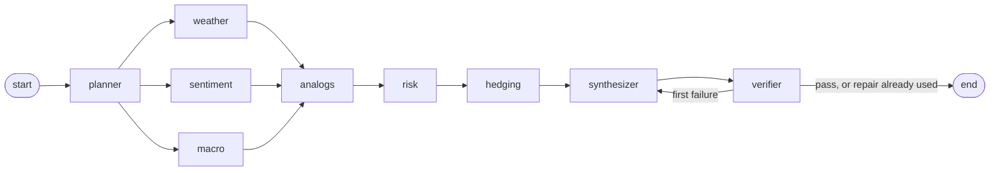
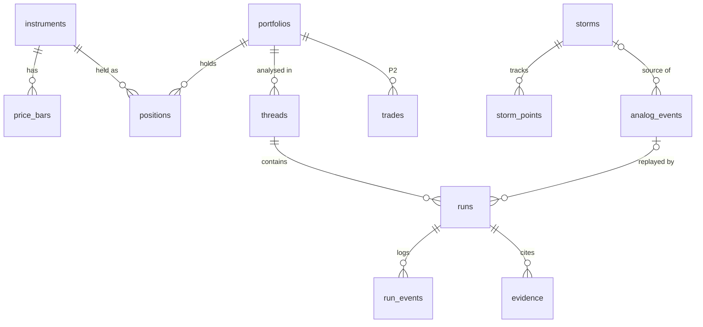

# Tempest: build spec

Financial intelligence terminal for Codeutsav problem statement 5 (`docs/PS5.md`). Build exactly what is written here. Tempest is a working name.

- **(decided)** = chosen by the team. **(default)** = recommended default; follow it unless the team changes it, and log every change in `docs/DECISIONS.md`.
- **P0 / P1 / P2** = priority. P0 is the demo path and must work at the hour-12 integration point. P1 completes the problem statement. P2 only if time remains.
- Do not build anything from the cut list (section 12).
- Assumptions: 24-hour build, team of 2 to 4, desktop web only, one demo portfolio, paper trading only, local demo (hosted deploy is optional).
- Language: TypeScript on Node.js everywhere (apps, packages, scripts, tests). No Python.
- Execution order, owners and gates are in `docs/ROADMAP.md`.

---

## 1. Project

A terminal for a portfolio manager. The user asks a question in plain English ("How will the forecasted Category 4 hurricane in the Gulf of Mexico affect our current energy holdings?"). A LangGraph.js graph of specialised agents reads live and historical data (storm tracks, refinery locations, news sentiment, macro series, prices), retrieves historical parallels from Pinecone, computes portfolio risk, proposes hedges, and answers in the style of the problem statement. Every number in the answer links to the source row or the deterministic computation that produced it.

**Demo story.** Replay Hurricane Ida as of the Friday close before landfall (27 Aug 2021). Ask the problem-statement question. The graph lights up step by step; the answer reports Gulf refining capacity at risk, the forecast move in Gulf Coast gasoline, natural gas and crude, the portfolio scenario loss, and a hedge plan with before/after risk. A drilldown shows every evidence row. A reliability page shows the combined model against single-source baselines.

**Context that shapes the design.** The hackathon runs over a weekend, so US markets are closed: prices are end-of-day only. The live part of the terminal is news and weather. A Gulf hurricane may not be active on demo day, so replay mode (any past timestamp, no look-ahead) and hypothetical storms ("what if a Category 4 hits Port Arthur in 48 hours?") are first-class.

## 2. Requirements

**Functional**

1. **P0** Ingest and index: news (GDELT, Alpha Vantage), weather (NHC, HURDAT2, Open-Meteo), commodity and macro series (FRED), daily prices (Tiingo). News text is embedded and indexed in Pinecone.
2. **P0** Multi-agent engine (LangGraph.js): planner, weather impact, news sentiment, macro regime, historical analogs, quant risk, hedging and execution, synthesizer, verifier.
3. **P0** Historical parallels: the analogs agent queries Pinecone for similar past events and their cross-asset reactions.
4. **P0** Analysis: news sentiment (Claude-scored, Alpha Vantage scores, GDELT tone), macro regime flags (FRED), quant risk (betas, correlations, VaR/CVaR, scenario and analog P&L) across equities, ETFs and commodity factors.
5. **P0** Natural-language queries produce hedging strategies, reallocation proposals with execution notes, and a risk assessment. Follow-up questions continue the same thread.
6. **P0** Terminal: live agent graph, answer with evidence chips, hedge table, drilldown audit, portfolio panel. **P1**: storm map, price and weather charts, live news feed, risk breakdown chart, data-source health.
7. **P0** Replay mode: any query can run as of a past timestamp with no look-ahead; four showcase presets.
8. **P1** Reliability report: leave-one-out backtest of the combined model against weather-only, sentiment-only and unconditional baselines.
9. **P2** "What happened next" panel (replay only), apply a hedge plan to the paper portfolio, printable audit report.

**Non-functional** (each has a measurement in section 9)

1. **Ingestion latency (P1):** per batch, p95 under 1 s from the upstream response being received to the Postgres write and the Pinecone upsert both being acknowledged (`fetched_at` to `indexed_at`). Time until a record becomes searchable (Pinecone is eventually consistent) is measured and reported separately, never claimed as part of this number.
2. **Orchestration accuracy:** an eval set of 15 queries checks plan intent, specialist selection, verifier pass and hedge-constraint pass. Rates are reported.
3. **Forecast reliability:** leave-one-out backtest over Gulf hurricanes 2017 to 2025. Directional accuracy, MAE and Spearman correlation for combined vs single-source baselines. The result is reported as measured, whatever it is.
4. **Auditability:** every number in an answer is an evidence placeholder resolved from the run's ledger. Every evidence row has source, source reference, as-of time, basis and producing node. Every step is persisted with inputs, outputs, model, tokens, latency and cost.
5. **Robustness:** rate limits, missing streams and LLM failures never crash a run. The run completes with degraded steps, explicit caveats and lowered confidence, and never with invented numbers. One run reads one consistent as-of snapshot.
6. **Responsiveness:** first run event under 1 s after submit; full run p50 under 45 s and p95 under 90 s over the eval set.
7. **Cost:** under $0.25 of LLM spend per run, logged per run.

## 3. Monorepo structure (decided)

The repository already contains the team template (Turborepo + pnpm, `@repo/*` scope, Express + tRPC + trpc-to-openapi + Scalar, Next.js + shadcn/ui, Drizzle). Keep its layout, tooling and naming. **NEW** marks additions.

**Remove from the template:** `packages/services/clients/google-oauth.ts`, `packages/services/user/`, `packages/trpc/server/routes/auth/`, `packages/database/models/user.ts` and its migration (regenerate the first migration), the `google-auth-library` dependency, and the "Streamyst" strings.

```
.
├── apps
│   ├── api                          Express: /trpc (incl. SSE subscriptions), /api (REST), /openapi.json, /docs
│   │   └── src                      Runs the agent graph in-process
│   │       ├── env.ts               PORT (8000), NODE_ENV, BASE_URL, CORS_ORIGIN, DEMO_TOKEN (optional)
│   │       ├── server.ts            template + CORS from CORS_ORIGIN
│   │       └── index.ts             listen; on boot mark runs left `running` as failed; start the live relay
│   ├── worker                       NEW  BullMQ ingestion and enrichment
│   │   └── src
│   │       ├── env.ts
│   │       ├── index.ts             queues, job schedulers, workers, graceful shutdown
│   │       └── jobs                 gdelt.ts, alphavantage.ts, nhc.ts, openmeteo.ts, fred.ts, tiingo.ts, enrich.ts
│   └── web                          Next.js App Router + shadcn/ui + Tailwind, dark terminal theme
│       ├── app
│       │   ├── layout.tsx, globals.css, page.tsx          the terminal
│       │   ├── reliability/page.tsx                        NEW  P1 backtest report
│       │   └── runs/[runId]/page.tsx                       NEW  P2 printable audit report
│       ├── components
│       │   ├── ui/                  shadcn/ui (template)
│       │   └── terminal/            NEW  section 8
│       ├── hooks/                   use-mobile.ts + NEW use-run-stream.ts, use-live-feed.ts
│       ├── providers/global.tsx     dark theme by default
│       └── trpc/                    client.ts, server.ts, create-client.ts (+ splitLink to httpSubscriptionLink)
├── packages
│   ├── contracts                    NEW  browser-safe: Zod schemas, enums, constants, formatters, fixtures
│   │   ├── schemas/                 market, news, weather, macro, analog, portfolio, evidence, agents, runs, live
│   │   ├── constants.ts             section 11 and the constants named in section 5
│   │   ├── format.ts                unit formatting and placeholder rendering (server and web)
│   │   ├── fixtures/                a complete Ida run as RunEvents, portfolio, news, storm (for UI work)
│   │   └── index.ts
│   ├── database
│   │   ├── models/                  one file per table (section 6)
│   │   ├── schema.ts, index.ts, env.ts, drizzle.config.ts, drizzle/
│   ├── services                     all I/O
│   │   ├── clients/                 http.ts (5.3), redis.ts, pinecone.ts, anthropic.ts,
│   │   │                            tiingo.ts, fred.ts, gdelt.ts, alphavantage.ts, nhc.ts, openmeteo.ts
│   │   ├── llm/                     the only code that calls the Anthropic API (5.7)
│   │   ├── market/ macro/ news/ weather/ analogs/ portfolio/ runs/ ingest/ system/
│   │   │                            each: model.ts (Zod, types) + index.ts (service class, template pattern)
│   │   ├── queues/index.ts          BullMQ queue names, payload schemas, producers
│   │   └── env.ts                   shared variables; clients validate their own lazily
│   ├── quant                        NEW  pure math: no I/O, no clock, no unseeded randomness
│   │   ├── series.ts                date alignment, log returns, windows
│   │   ├── stats.ts                 mean, std, OLS beta and R², correlation, Spearman, weighted stats
│   │   ├── risk.ts                  VaR/CVaR, scenario P&L, analog replay P&L
│   │   ├── hedge.ts                 min-variance hedge ratio, sizing, constraint checks, simulate
│   │   ├── geo.ts                   haversine, track interpolation, capacity at risk
│   │   ├── forecast.ts              feature z-scoring, kernel kNN forecast
│   │   ├── backtest.ts              leave-one-out harness and metrics
│   │   └── *.test.ts
│   ├── agents                       NEW  LangGraph.js graph
│   │   ├── graph.ts                 state, nodes, edges, compile with PostgresSaver
│   │   ├── context.ts               RunContext registry, instrumentNode wrapper
│   │   ├── ledger.ts                evidence ledger: add, get, render
│   │   ├── verify.ts                grounding and constraint checks
│   │   ├── fallbacks.ts             rule-based plan, fallback hedge, template answer
│   │   ├── nodes/                   planner, weather, sentiment, macro, analogs, risk, hedging, synthesizer, verifier
│   │   ├── prompts/                 one system prompt per LLM call
│   │   └── *.test.ts                graph tests with a fake LLM
│   ├── trpc
│   │   ├── server
│   │   │   ├── trpc.ts, context.ts  template; context carries the request's demo token
│   │   │   ├── routes/              health, system, portfolio, market, news, weather, macro, analogs, runs, live, backtest
│   │   │   ├── services/index.ts    instantiates service classes (template pattern)
│   │   │   └── index.ts             serverRouter
│   │   └── client/index.ts          router types + @trpc/client re-exports (template)
│   ├── logger, eslint-config, typescript-config      template
├── scripts                          NEW  tsx: seed.ts (+ seed/*.ts), backtest.ts, eval-queries.ts, ingest-bench.ts, drills.ts,
│                                         run-query.ts (one run from the CLI), stream-run.ts (print a run's events)
├── data
│   ├── seed/                        NEW  committed: refineries.geojson, refinery-tickers.json, analog-events.json
│   ├── eval/queries.json            NEW  committed
│   └── cache/                       NEW  gitignored raw API responses (share as a zip inside the team)
├── docker-compose.yml               postgres (template) + NEW redis
└── turbo.json, pnpm-workspace.yaml, package.json, NEW vitest.workspace.ts
```

**Dependency rules** (enforced with `no-restricted-imports`)

1. Apps depend on packages. Packages never import from apps.
2. `web` imports only `@repo/contracts` and types from `@repo/trpc/client`.
3. `quant` imports only `@repo/contracts`. It never reads the clock or does I/O, so every function is deterministic and unit-testable.
4. `services` own all I/O: Postgres, Redis, Pinecone, HTTP, Anthropic. `database` imports no internal package.
5. `agents` import `services`, `quant` and `contracts`. Only `services/llm` calls the Anthropic API; the worker's news scoring uses the same module.
6. tRPC routes validate with `contracts` schemas, call a service or `agents.startRun`, and return. No business logic in routes.
7. LLM-written text never contains numbers. Numbers come from the evidence ledger (5.6).
8. Every data read takes `asOf` (5.1).
9. Each app and package validates its environment with Zod at startup; service clients validate their own variables on first use, so the api does not need worker-only keys and the reverse.

**Service domains** (`packages/services`, class per domain as in the template's `UserService`)

| Domain | Functions |
|---|---|
| market | `instruments`, `bars(symbol, from, asOf)`, `closesAt(symbols, asOf)`, `returns(symbols, lookback, asOf)`, `adv(symbol, asOf)`, `realized(symbols, asOf, horizonDays)` |
| macro | `snapshot(asOf)`, `series(id, from, asOf)` |
| news | `upsertBatch(items)`, `search(text, { asOf, windowHours, tickers })`, `list(filters)`, `scoreUnscored(limit)` |
| weather | `stormsAt(asOf)`, `track(stormId, asOf)`, `hypotheticalTrack(params, asOf)`, `refineries()`, `hubForecasts()` |
| analogs | `search(text, { kinds, asOf, topK })`, `get(ids)`, `list()` |
| portfolio | `snapshot(portfolioId, asOf)` |
| runs | `create`, `appendEvent`, `addEvidence`, `complete`, `get`, `list`, `eventsAfter(runId, seq)` |
| ingest | `runSource(name)` (fetch, validate, normalize, dedupe, persist and index, publish), `status` |
| system | `sourceStatus()`, `ingestLatency(windowHours)`, `ingestNow(sources)` |
| llm | `parseStructured`, `runTools`, usage and cost accounting |

## 4. Stack

| Layer | Choice | Status | Notes |
|---|---|---|---|
| Monorepo | pnpm + Turborepo, tsup for Node apps | decided | The template |
| Frontend | Next.js App Router, shadcn/ui, Tailwind, Recharts (template `chart.tsx`), React Flow (`@xyflow/react`), `react-leaflet` with OpenStreetMap tiles | decided | Desktop layout, dark theme |
| API | Express + tRPC v11 at `/trpc`, REST via `trpc-to-openapi` at `/api`, Scalar at `/docs` | decided | Template. Subscriptions use SSE (`httpSubscriptionLink`), no WebSocket server |
| Orchestration | LangGraph.js (`@langchain/langgraph`) + `@langchain/langgraph-checkpoint-postgres` | decided | Fixed graph, thread memory for follow-ups |
| LLM | Claude through `@anthropic-ai/sdk`: `claude-sonnet-5-5` for planner, hedging, synthesizer; `claude-haiku-4-5` for news scoring and specialist notes | decided | Rules in 5.7 |
| Vector database | Pinecone serverless, integrated embedding `llama-text-embed-v2` | decided | Rules in 5.4 |
| Database | Postgres + Drizzle | decided | Template |
| Queue, cache, pub/sub | One Redis (`maxmemory-policy noeviction`) + BullMQ | decided | Ingestion schedules, per-source rate limits, response cache, live relay |
| Validation | Zod (template version) | decided | All shared shapes live in `@repo/contracts` |
| Tests | Vitest | decided | Known-answer tests for `quant`, fixture tests for clients, fake-LLM graph tests |
| Scripts | `tsx` | default | Seeds, backtest, eval, bench, drills |
| Hosting | Local demo. Optional: Railway (api, worker, Postgres, Redis) + Vercel (web) | default | P2 |

**External data sources** (limits are as published at the time of writing; confirm in the first hour, see ROADMAP section 2)

| Source | Used for | Key | Free limit | Schedule | Notes |
|---|---|---|---|---|---|
| Tiingo | Daily OHLCV and adjusted close for the universe since 2015 | `TIINGO_API_KEY` | 50 requests/hour, 1,000/day, 500 symbols/month | Seed once; daily at 22:30 UTC on weekdays | Licence forbids redistribution: never commit Tiingo data |
| FRED | Commodity spot factors and macro series | `FRED_API_KEY` | Generous | Seed once; every 6 hours | Missing values arrive as `"."` |
| Alpha Vantage `NEWS_SENTIMENT` | Finance news with per-ticker sentiment | `ALPHAVANTAGE_API_KEY` | 25 requests/day | Hourly, at most 24/day | Throttling returns HTTP 200 with an `Information` or `Note` body. Price endpoints are not used (full history is premium) |
| GDELT DOC 2.0 | Global news (`artlist`), tone and volume timelines | none | About 1 request per 5 s | Every 15 minutes | Timeline modes reach back to 2017. `artlist` returns at most 250 records and only the last 3 months of any window |
| NHC `CurrentStorms.json` + NOAA tropical MapServer | Active storms, forecast points | none | — | Every 10 minutes | Send a `User-Agent` with a contact address. Look up MapServer layers by name, not id |
| HURDAT2 | Historical tracks for events, replay and backtest | none | — | Seed once | Newest `hurdat2-1851-*.txt` on nhc.noaa.gov/data |
| Open-Meteo | Wind gust and precipitation forecast at refining hubs | none | Non-commercial, 10,000 calls/day | Hourly | All hubs in one multi-location call |
| EIA Energy Atlas | Refinery locations and capacity | none | — | Seed once (committed GeoJSON) | Public domain |
| Pinecone | Vector index | `PINECONE_API_KEY` | Starter: 2 GB, 1M read units, 2M write units, 5M embedding tokens per month; AWS us-east-1 only | — | Reranking is not used (500 requests/month quota) |
| Anthropic | LLM | `ANTHROPIC_API_KEY` | Account limits | — | |

**Environment variables, by owner**

| Owner | Variables |
|---|---|
| `packages/database` | `DATABASE_URL` |
| `packages/services` | `REDIS_URL`, `PINECONE_API_KEY`, `PINECONE_INDEX` (default `tempest`), `ANTHROPIC_API_KEY`, `MODEL_REASONING` (default `claude-sonnet-5-5`), `MODEL_FAST` (default `claude-haiku-4-5`), `TIINGO_API_KEY`, `FRED_API_KEY`, `ALPHAVANTAGE_API_KEY`, `NOAA_USER_AGENT` (for example `tempest-codeutsav (team@example.com)`), `DISABLE_SOURCES` (comma list, drills only) |
| `apps/api` | `PORT` (8000), `NODE_ENV`, `BASE_URL`, `CORS_ORIGIN` (`http://localhost:3000`), `DEMO_TOKEN` (optional; required on `runs.create` and `system.ingestNow` when set) |
| `apps/worker` | `SCHEDULES_ENABLED` (default `true`) |
| `apps/web` | `NEXT_PUBLIC_API_URL` (`http://localhost:8000/trpc`) |

## 5. Architecture rules (decided)

### 5.1 As-of discipline (no look-ahead)

Every read takes `asOf`. A live run uses the run start time; a replay run uses the preset or user value. One run reads one snapshot, so numbers cannot shift while it runs.

- A daily bar dated D becomes available at D 21:00 UTC (`barAvailableAt` in `contracts/format.ts`). Reads return bars with `date + 21h <= asOf`.
- FRED daily series follow the same rule. FRED weekly series (inventories) become available at the observation date plus 5 days.
- News: `published_at <= asOf` and `published_at >= asOf - NEWS_WINDOW_HOURS` (72).
- Storms: observed points with `valid_at <= asOf`. Forecast points: live uses the latest advisory with `issued_at <= asOf`; replay uses the best track for the next 72 hours, labelled "perfect-forecast replay" (5.12).
- Analog events: only events whose realized window ends before `asOf` (`realized_until < asOf`). An Ida replay can never see Ida's own outcome or any later storm.
- A test asserts that, for `asOf = 2021-08-27T21:00Z`, no service returns a row dated later than that (labelled replay forecast points excepted).

### 5.2 Ingestion pipeline

Stages: BullMQ job scheduler per source, fetch through the HTTP wrapper (5.3), Zod validation, normalisation to `contracts` types, de-duplication (news by URL; bars, observations and storm points by primary key), then in parallel the Postgres write and the Pinecone `upsertRecords` (batches of at most 96), then `indexed_at`, then a `LiveEvent` on the Redis channel `live`, then an `enrich` job for new news ids.

- **Latency:** `fetched_at` is when the upstream response body is fully received; `indexed_at` is when both writes resolved. Both are stored on every news item, so latency is a SQL query.
- **Ticker tagging** at ingest is rule-based and fast: match `TICKER_ALIASES` (company names and tickers) in the title, plus Alpha Vantage's ticker list.
- **Enrichment** (`enrich` queue, concurrency 2): batches of up to 20 unscored items go to Haiku for structured scoring (sentiment -1 to 1, relevance 0 to 1, tickers from the universe only). Updates the row and publishes `news.scored`. Not part of the sub-second path.
- **Queries** (constants): `NEWS_QUERIES` for GDELT live ingestion, `SENTIMENT_QUERY` for tone and volume timelines: `(hurricane OR "tropical storm") (oil OR refinery OR gasoline OR "natural gas") sourcelang:english`.
- **Manual trigger** (P1): `system.ingestNow` queues an immediate GDELT and NHC job (and Alpha Vantage if quota remains). Used in the demo to show latency live.

### 5.3 Source robustness

`services/clients/http.ts` wraps every external call:

1. Timeout 10 s (`AbortSignal.timeout`).
2. Two retries on network errors and 5xx, with jittered backoff (about 0.5 s, then 1.5 s).
3. HTTP 429, or a provider throttle body (Alpha Vantage `Information`/`Note`), raises `RateLimitedError(retryAfterMs)`. Jobs turn it into a queue rate limit instead of retrying.
4. Every response is validated with Zod; a failure raises `BadPayloadError` and logs a 200-character sample.
5. Circuit breaker per source: 3 consecutive failures open it for 5 minutes; calls then fail fast with `SourceDownError`. `DISABLE_SOURCES` forces this state (drills).
6. Cache: `cached(key, ttlSeconds, fn)` in Redis, plus a stale copy kept 24 hours. When a call fails and a stale copy exists, it returns `{ data, stale: true }`.
7. Status per source in the Redis hash `source:{name}`: `status` (ok, degraded, rate_limited, down), `lastOkAt`, `lastErrorAt`, `lastError`, `lastLatencyMs`.

Quotas: Alpha Vantage daily counter `quota:alphavantage:{yyyy-mm-dd}` stops at 24. Tiingo limiter 45 per hour. GDELT limiter 1 per 5 s. In a run, services return `{ data, stale }` or `{ unavailable: reason }`; nodes never substitute invented values.

### 5.4 Vector index (Pinecone)

One integrated-embedding index (`PINECONE_INDEX`), model `llama-text-embed-v2`, field map `{ text: "text" }`, created by `pnpm seed` when missing.

| Namespace | Record | Id | `text` | Metadata (flat values only) |
|---|---|---|---|---|
| `news` | one per news item | `n_<sha1(url)>` | title + ". " + summary, at most 1,500 characters | `source`, `publishedAt` (unix seconds), `tickers` (string list), `topics` (string list) |
| `events` | one per analog event | `e_<eventId>` | generated description (section 10.5) | `kind`, `t0` and `realizedUntil` (unix seconds), `region` |
| `weather` (P2) | one per NHC discussion paragraph | `w_<stormId>_<advisory>_<i>` | paragraph | `stormId`, `issuedAt` (unix seconds) |

- Search with `searchRecords` and a metadata `filter` (time range, `kind`, `tickers` with `$in`). Pinecone returns ids and scores; Postgres holds the full rows.
- No reranking. Seeds wait until namespace counts are visible before evals run.

### 5.5 Agent graph (LangGraph.js)

The graph has the same shape on every run, so the UI graph is stable:



| Node | Job | LLM | Writes |
|---|---|---|---|
| `planner` | Turn the question, thread history, portfolio summary, mode and active storms into a `Plan`: intent (`event_impact`, `portfolio_risk`, `hedge`, `what_if`, `explain`, `out_of_scope`), event (`live`, `replay`, `hypothetical` or `none`; storm id or hypothetical parameters), focus symbols and sectors, horizon (default 5 trading days), which specialists are needed, whether reallocation was asked for. Fallback: keyword rules in `fallbacks.ts` | Sonnet, effort low, structured | `plan` |
| `weather` | Resolve the storm, build its track, compute capacity at risk for the Gulf Coast and per company, read hub forecasts (live only). Rules in 5.8 | Haiku note | `weather` |
| `sentiment` | Search Pinecone `news` at `asOf`, score unscored hits, aggregate energy-sector and per-holding sentiment (relevance-weighted, 24-hour recency half-life), read GDELT tone and volume z-scores | Haiku note (and scoring) | `sentiment` |
| `macro` | FRED snapshot: gasoline and crude inventories against their 5-year same-week average (tight below -3%, loose above +3%), VIX level (calm below 18, elevated to 25, stressed above), 10-year yield and dollar index 20-day change | Haiku note | `macro` |
| `analogs` | Search Pinecone `events` with a description built from the storm features; kernel kNN forecast (5.9); cross-asset reaction table of the top analogs; top 3 non-hurricane parallels for context | Haiku note | `analogs` |
| `risk` | Portfolio snapshot, betas, correlations, VaR/CVaR, scenario and analog P&L (5.10) | none | `risk` |
| `hedging` | Hedge and reallocation plan with execution notes through two tools (5.11). Fallback: min-variance hedge | Sonnet, effort medium, tool runner | `hedgePlan` |
| `synthesizer` | Final `Answer` with evidence placeholders (5.6). Fallback: template answer | Sonnet, effort medium, structured | `answer` |
| `verifier` | Grounding and constraint checks (5.6); routes to repair or end | none | `verification` |

A "Haiku note" is 1 to 3 short findings, each a placeholder template with evidence keys, written from the node's computed output. The numbers a node produces never come from its note.

**Rules**

1. Parallel nodes write disjoint state keys. Only `history` uses an append reducer (one `{ runId, query, headline }` per run). The planner resets the per-run keys at the start of each run.
2. A node that the plan does not need returns status `skipped`; the graph shape never changes.
3. `RunContext` (`runId`, `asOf`, `mode`, `portfolioId`, ledger, `emit`, abort signal) lives in an in-process registry keyed by `runId`. The graph receives only `runId` through `configurable`; nothing non-serializable enters state or checkpoints.
4. `instrumentNode(name, fn)` wraps every node: emits `step.started` and `step.completed` or `step.failed` with duration, LLM usage and the thinking summary. A thrown error becomes a degraded output `{ status: "unavailable", reason }` and the graph continues. Nothing aborts a run except cancellation.
5. Thread memory: compile with `PostgresSaver` (schema `langgraph`, `setup()` once at api start); `thread_id` is `threads.id`. Follow-ups see `history` and the previous `plan` and `weather`, so "what if it only reaches Category 2?" reuses the storm with an override.
6. The graph runs inside `apps/api` (one instance). At most 2 runs at a time; a third gets `TOO_MANY_REQUESTS`. On boot, runs left `running` become `failed` with "server restarted".
7. Confidence is computed, not written by the LLM: start at high; drop one level for each core input (weather, sentiment, analogs) that is unavailable or stale, and when the analog effective sample size is below 4; never above medium for hypothetical storms.

### 5.6 Evidence ledger and numeric grounding

The rule that makes the problem statement's "without hallucinating financial metrics" checkable: **the LLM never types a number.**

- Every value that may appear in an answer, a hedge rationale or a chart caption is an evidence row created with `ledger.add(...)` by the node that read or computed it. Keys are `E1`, `E2`, ... per run.
- Evidence fields: `kind` (price, news, weather, macro, analog, computation, model, assumption, portfolio), `label`, `value` or `textValue`, `unit`, `basis` (observed, computed, model, assumption), `source`, `sourceRef` (URL, series id, advisory, formula), `asOf`, `stale`, `producedBy`, `payload` (inputs of a computation, for example the list of refineries summed).
- LLM-written strings reference evidence as `{{E12}}`. They contain no digits outside placeholders (allowlist: `S&P 500`).
- `contracts/format.ts` formats by unit: `pct` (fraction to "40%"), `pct_signed` ("+8.1%"), `usd` ("$1.2M"), `kt`, `bpd` ("1.25M b/d"), `days`, `score` (2 decimals), `z` (1 decimal), `ratio`, `count`, `category` ("4"), `date` ("Aug 29, 2021"), `text` (`textValue`).
- The server stores the template and the rendered text. The UI renders the template as chips (formatted value; hover shows label, source and as-of; click opens the evidence row).
- Numbers typed by the user ("Category 4") become evidence with basis `assumption` and source `user`. Sentiment scores are model outputs: basis `model`, `sourceRef` = model id.

**Verifier checks**

1. Every placeholder exists in the run's ledger.
2. No digits outside placeholders in any LLM-authored field: answer, bullets, caveats, hedge summary, rationales, exit triggers.
3. Every hedge action passes the limits in 5.11 and cites at least one evidence key; every answer bullet cites at least one.
4. Only universe symbols appear.
5. Caveats mention every unavailable or stale input; missing ones are appended deterministically.

On failure the synthesizer gets one repair attempt with the violation list. A second failure produces the deterministic template answer from structured data, and the run ends `partial`.

### 5.7 LLM usage (decided)

- All calls go through `services/llm`, with `new Anthropic({ maxRetries: 2, timeout: 60_000 })`.

| Call | Model | Effort | Output | `max_tokens` |
|---|---|---|---|---|
| planner | `MODEL_REASONING` | low | `Plan` | 4,000 |
| specialist notes (4) | `MODEL_FAST` | none | `Notes` | 2,000 |
| news scoring | `MODEL_FAST` | none | `Scores` | 4,000 |
| hedging | `MODEL_REASONING` | medium | tool loop ending in `submit_plan` | 16,000 |
| synthesizer | `MODEL_REASONING` | medium | `Answer` | 16,000 |

- Structured output: `client.messages.parse` with `output_config.format` built by the SDK's Zod helper (`zodOutputFormat`). Never forced `tool_choice` (`any` or `tool` returns 400 on `claude-sonnet-5-5`); tools are defined with `strict: true` and the prompt says when to call them.
- Sonnet thinking stays adaptive (the default) with `display: "summarized"`; the summary is stored on the step for the drilldown. Never ask the model to write its reasoning as text.
- Set `output_config.effort` explicitly on Sonnet (its default is high). Do not send `temperature`, `top_p` or `top_k` to Sonnet. Haiku gets no effort and no thinking; `temperature: 0`.
- Check `stop_reason` before reading content. `refusal`: the node degrades and logs `stop_details.category`. `max_tokens`: one retry with double the limit, then degrade.
- Server-side fallback on Sonnet calls: `fallbacks: "default"` with the beta `server-side-fallback-2026-07-01`, if the installed SDK's parse and tool-runner calls accept it; otherwise omit it and log that in `docs/DECISIONS.md`.
- Prompts: one stable system prompt per call in `agents/prompts/`, data as JSON in the user message, the evidence-key list, the no-digits rule, the allowed symbols. Put `cache_control` on the system block (it is ignored when the prompt is below the cache minimum).
- Usage: input and output tokens per call; cost from `MODEL_PRICES` (USD per million tokens: Sonnet 5.5 $2 in / $10 out, Haiku 4.5 $1 / $5); totals stored on the run.

### 5.8 Weather impact model

**Storm resolution** (weather node)

1. Replay: HURDAT2 storms with an observed point in the 12 hours before `asOf`; pick the one named in the question, else the one whose latest point is inside `GULF_BOX` (18-31°N, 98-80°W).
2. Live: NHC active Atlantic storms; pick by name, else the one inside or forecast into `GULF_BOX`.
3. Hypothetical: from the plan (5.12).
4. None: status `unavailable`, reason "no active Gulf storm at as-of"; the synthesizer suggests replay or a hypothetical.

**Track:** observed points up to `asOf` plus forecast points. Live forecast points come from the NOAA MapServer layer `<bin> Forecast Points` for the storm's `binNumber`; if that fails, a 48-hour persistence track from the storm's movement direction and speed, labelled. Replay uses the next 72 hours of best track, labelled.

**Impact:** forecast points (and observed points from the last 12 hours) with wind at least 64 kt, interpolated to 1-hour steps. A refinery is at risk if it lies within `IMPACT_RADIUS_KM` (100) of any impact point (haversine).

**Outputs** (all evidence): storm name, current and peak forecast category (Saffir-Simpson in knots: Cat 1 64-82, Cat 2 83-95, Cat 3 96-112, Cat 4 113-136, Cat 5 137+), landfall time and nearest `LANDFALL_REGIONS` anchor (replay: HURDAT2 `L` record; live: first forecast point within 50 km of the coast anchors), number of refineries at risk, Gulf Coast capacity at risk (at-risk capacity over the PADD 3 total), per-company capacity at risk (at-risk capacity over the company's total US capacity), the at-risk refinery list (payload), and, live only, the maximum gust in the next 120 hours at each hub in `HUBS`.

Known limit, stated in caveats when relevant: the model uses wind distance only and ignores flooding (Harvey 2017 hurt refineries mostly through rain).

### 5.9 Forecast model

**Targets:** 5-trading-day forward log return of `GULF_GASOLINE`, `WTI` and `HH_NATGAS` from the last close at or before `asOf`.

**Event features** (z-scored across the event set)

| Feature | Group | Definition |
|---|---|---|
| `windKt` | weather | Maximum wind of track points in the 24 hours before landfall (or closest approach to the hub centroid) |
| `capAtRisk` | weather | Gulf Coast capacity at risk (5.8) using the event's track |
| `offshoreExposure` | weather | Share of hurricane-force track points inside `OFFSHORE_BOX` (26-29.5°N, 95-88°W) |
| `toneZ` | sentiment | GDELT `timelinetone` for `SENTIMENT_QUERY`: mean of the 2 days before t0 against the mean and std of the 28 days before those |
| `volZ` | sentiment | The same with `timelinevol` |

**Model:** Gaussian kernel kNN. `w_j = exp(-‖x - x_j‖² / (2h²))`, `h = 1.0`, fixed and never tuned on results. Forecast = weighted mean of the analogs' realized returns; spread = weighted std; effective n = `(Σw)² / Σw²`. Feature sets: weather-only (W), sentiment-only (S), combined (C). Unconditional baseline (N) = plain mean.

**Live:** C over every eligible event (5.1). If sentiment features are unavailable, use W and say so. Evidence: mean and spread per target, effective n, and the top analogs with similarity, weight and realized 5-day returns. The same functions run the backtest (section 9.1), so the reported reliability is the reliability of the live model.

### 5.10 Risk engine (`packages/quant`)

- **Returns:** daily log returns of Tiingo adjusted closes and FRED factor closes, aligned on common dates. Lookback 252 days for betas and correlations, 504 for VaR.
- **Portfolio snapshot:** NAV $10,000,000; quantity = floor(target weight x NAV / close at `asOf`); the remainder is cash. One rule for live and replay.
- **Betas:** OLS of each holding on `SPY`, `GULF_GASOLINE`, `WTI`, `HH_NATGAS`, with R². Each holding maps to the commodity factor with the highest R²; holdings with no commodity R² of at least 0.1 map to `SPY` (forecast 0).
- **Correlations:** holdings and factors, 252 days.
- **VaR and CVaR at 95%:** historical simulation of today's quantities over past returns; 1-day, and 5-day from overlapping 5-day sums.
- **Scenario P&L:** `r_h = β_h × forecast(mappedFactor_h) + γ × capAtRisk_company(h)` (the second term for refiners only); P&L = Σ value_h × (e^r_h - 1).
- **Analog replay P&L:** for each top analog where every holding has realized 5-day returns, P&L_i = Σ value_h × (e^r_h,i - 1). Report weighted mean, worst and n.
- **Refiner elasticity γ:** OLS across hurricane events and refiners (VLO, MPC, PSX, PBF) of refiner 5-day return minus XLE 5-day return on company capacity at risk. Store γ, its standard error and n as evidence. If n < 10, γ = 0 and the scenario notes that the capacity effect is not modelled.
- **Output:** `RiskReport` plus evidence for NAV, VaR/CVaR, the three largest factor exposures, scenario P&L and analog P&L.

### 5.11 Hedging and execution

- **Menu (`HEDGE_MENU`):** buy or sell XLE, XOP, CRAK, USO, BNO, UNG, UGA, SPY, JETS; sell (reduce) existing holdings. No new single-stock shorts, no options or futures: UNG, UGA and USO stand in for futures exposure.
- **Limits (`HEDGE_LIMITS`):** gross hedge notional at most 30% of NAV; any one action at most 10% of NAV; notional at most 1% of 20-day average dollar volume; integer quantities above zero.
- **Suggestions:** for each menu ETF, the min-variance hedge ratio against the energy sleeve (252 days) and a capped suggested quantity, passed to the model with evidence keys.
- **Tools** (the node passes name, description, Zod schema and handler to `llm.runTools`, which builds strict `betaZodTool` definitions for the SDK tool runner):
  - `simulate_hedges({ actions })` returns before and after `RiskSnapshot` and any limit violations. Creates no evidence.
  - `submit_plan({ actions, summary })` validates, simulates, stores the plan, creates evidence for the after-metrics, and returns violations if any (the model may resubmit). At most 6 tool iterations.
- **Action fields:** `type` (hedge or reallocation), `symbol`, `side`, `quantity`, `timing` (now, before_landfall, staged), `orderType` (market, limit), `exitTrigger` (template), `rationale` (template), `evidenceKeys`.
- **Fallback** (no submitted plan, or LLM unavailable): one sell of the menu ETF with the best min-variance fit to the energy sleeve, sized by the ratio within limits; marked `source: "fallback"`.
- **P2:** "Apply to paper portfolio" turns actions into target-weight changes and one `trades` row each. Nothing is ever sent to a broker.

### 5.12 Replay and hypothetical storms

- **Presets (`REPLAY_PRESETS`):** Hurricane Ida 2021 (`asOf` 2021-08-27T21:00Z, default), Laura 2020 (2020-08-25T21:00Z), Harvey 2017 (2017-08-24T21:00Z), Francine 2024 (2024-09-10T21:00Z). Rule: the last close at least 24 hours before landfall. Preset ids are the analog event ids (for example `hurricane-ida-2021`). Any `asOf` from 2017-01-01 is allowed.
- **Replay news:** the seed fetches GDELT `artlist` for `[asOf - 72h, asOf]` for each preset and each `NEWS_QUERIES` entry, then stores, indexes and scores the items.
- **Replay forecast track:** the next 72 hours of best track, labelled "perfect-forecast replay" in the UI and in caveats.
- **Hypothetical storms:** the plan supplies category (1 to 5), landfall region (`LANDFALL_REGIONS`) and hours to landfall (default 48). Track: 6-hourly straight line from 24.5°N 89.0°W to the region anchor; wind 75, 90, 105, 125 or 145 kt by category until landfall, then one inland point 12 hours later at half wind. Evidence basis `assumption`.
- **What happened next (P2, replay only, outside the run):** realized 1-day and 5-day moves of the targets and the portfolio after `asOf`, next to the run's forecast.

### 5.13 Streaming to the browser

- tRPC subscriptions over SSE: `splitLink` sends subscriptions to `httpSubscriptionLink`, everything else to the template's HTTP link. Enable the tRPC SSE ping.
- `runs.stream({ runId, lastEventId })` yields stored `run_events` with `seq` above `lastEventId`, then live events from an in-process EventEmitter until `run.completed` or `run.failed`. Each event is yielded as `tracked(String(seq), event)`, so a reconnect resumes where it stopped.
- `live.feed()`: the worker publishes `LiveEvent`s to the Redis channel `live`; the api subscribes once and fans out. No resume; the UI refetches its lists on reconnect.

---

## 6. Database (Postgres, Drizzle)

One Drizzle model file per table in `packages/database/models/`, all re-exported from `schema.ts`. Timestamps are `timestamptz` in UTC. Export `$inferSelect` / `$inferInsert` per model.



`news_items`, `macro_observations`, `refineries` and `backtests` stand alone.

**instruments** (`models/instrument.ts`)

| Column | Type | Constraints | Why |
|---|---|---|---|
| symbol | text | PK | `XOM`, or a factor id such as `GULF_GASOLINE` |
| name | text | NOT NULL | UI |
| asset_class | varchar | NOT NULL, CHECK in (`equity`, `etf`, `commodity`) | risk grouping |
| sector | varchar | NULL | `integrated`, `e&p`, `refiner`, `energy_etf`, `commodity_proxy`, `airlines`, `market` |
| tradable | boolean | NOT NULL | factors are not tradable |
| source | varchar | NOT NULL, CHECK in (`tiingo`, `fred`) | which client loads it |
| source_ref | text | NULL | FRED series id |
| proxy_for | varchar | NULL | for example UNG proxies `HH_NATGAS` |

**price_bars** (`models/price-bar.ts`)

| Column | Type | Constraints | Why |
|---|---|---|---|
| symbol | text | PK part, FK instruments, ON DELETE CASCADE | |
| date | date | PK part | exchange date |
| open, high, low, close | double precision | NOT NULL | FRED factors store the value in all four |
| adj_close | double precision | NOT NULL | returns use this; equals `close` for FRED |
| volume | bigint | NULL | liquidity limit (ADV) |

**macro_observations** (`models/macro-observation.ts`): `series_id` text, `date` date, `value` double NOT NULL; PK (`series_id`, `date`). Rows with FRED `"."` are skipped.

**news_items** (`models/news-item.ts`)

| Column | Type | Constraints | Why |
|---|---|---|---|
| id | uuid | PK, default random | |
| source | varchar | NOT NULL, CHECK in (`gdelt`, `alphavantage`) | |
| url | text | NOT NULL, UNIQUE | de-duplication across sources |
| title | text | NOT NULL | |
| summary | text | NULL | Alpha Vantage only |
| domain | text | NULL | |
| published_at | timestamptz | NOT NULL | as-of filter |
| fetched_at | timestamptz | NOT NULL | NFR 1 |
| indexed_at | timestamptz | NULL | NFR 1; null until both writes resolve |
| tickers | text[] | NOT NULL, default `{}` | universe symbols only |
| topics | text[] | NOT NULL, default `{}` | |
| source_sentiment | real | NULL | Alpha Vantage overall score |
| ticker_sentiment | jsonb | NULL | Alpha Vantage per-ticker scores |
| sentiment | real | NULL | -1 to 1, Haiku |
| relevance | real | NULL | 0 to 1, Haiku |
| scored_at | timestamptz | NULL | |
| score_model | varchar | NULL | model id |

Index: (`published_at` DESC).

**storms** (`models/storm.ts`): `id` text PK (uppercase, for example `AL092021`), `name` text NOT NULL, `season` int NOT NULL, `source` varchar CHECK in (`hurdat2`, `nhc`).

**storm_points** (`models/storm-point.ts`)

| Column | Type | Constraints | Why |
|---|---|---|---|
| storm_id | text | PK part, FK storms, ON DELETE CASCADE | |
| kind | varchar | PK part, CHECK in (`observed`, `forecast`) | |
| issued_at | timestamptz | PK part | observation time, or the advisory time for forecasts |
| valid_at | timestamptz | PK part | |
| lat, lon | double precision | NOT NULL | west longitudes are negative |
| wind_kt | int | NOT NULL | |
| pressure_mb | int | NULL | |
| status | varchar | NULL | HU, TS, TD, EX... |
| record_id | varchar | NULL | HURDAT2 `L` marks landfall |

**refineries** (`models/refinery.ts`): `id` text PK, `name`, `company`, `ticker` (NULL when not listed in the universe), `state`, `padd` int, `lat`, `lon`, `capacity_bpd` int NOT NULL.

**analog_events** (`models/analog-event.ts`)

| Column | Type | Constraints | Why |
|---|---|---|---|
| id | text | PK | slug, for example `hurricane-ida-2021` |
| kind | varchar | NOT NULL, CHECK in (`hurricane`, `winter_storm`, `supply_shock`, `geopolitical`, `macro`) | |
| name | text | NOT NULL | |
| storm_id | text | NULL, FK storms | hurricanes only |
| t0 | date | NOT NULL | forecast origin (last close at least 24 hours before landfall) |
| landfall_at | timestamptz | NULL | |
| region | varchar | NULL | `LANDFALL_REGIONS` key |
| features | jsonb | NOT NULL | `windKt`, `capAtRisk`, `offshoreExposure`, `toneZ`, `volZ` (nullable members) |
| company_cap_at_risk | jsonb | NULL | `{ ticker: fraction }` |
| reactions | jsonb | NOT NULL | `{ symbol: { d1, d5, d20 } }` log returns from t0; null where data is missing |
| realized_until | date | NOT NULL | t0 + 20 trading days; as-of rule |
| outage_days | real | NULL | P2, curated with a source URL |
| description | text | NOT NULL | the embedded text |
| sources | jsonb | NOT NULL, default `[]` | URLs |

**portfolios** (`models/portfolio.ts`): `id` uuid PK, `name` text NOT NULL, `nav` double NOT NULL (10,000,000), `created_at`.

**positions** (`models/position.ts`): `portfolio_id` uuid FK portfolios ON DELETE CASCADE, `symbol` text FK instruments, `target_weight` double NOT NULL CHECK (`target_weight <> 0`; negative means short); PK (`portfolio_id`, `symbol`). Cash = 1 - Σ weights.

**threads** (`models/thread.ts`): `id` uuid PK (also the LangGraph `thread_id`), `portfolio_id` uuid FK, `title` text, `created_at`.

**runs** (`models/run.ts`)

| Column | Type | Constraints | Why |
|---|---|---|---|
| id | uuid | PK | |
| thread_id | uuid | NOT NULL, FK threads, ON DELETE CASCADE | |
| query | text | NOT NULL | at most 500 characters |
| mode | varchar | NOT NULL, CHECK in (`live`, `replay`) | |
| as_of | timestamptz | NOT NULL | 5.1 |
| replay_event_id | text | NULL, FK analog_events | preset used |
| status | varchar | NOT NULL, CHECK in (`running`, `succeeded`, `partial`, `failed`) | |
| plan, answer, hedge_plan, risk, forecast, verification | jsonb | NULL | validated by `contracts` schemas; `answer` holds template and rendered text |
| confidence | varchar | NULL, CHECK in (`low`, `medium`, `high`) | 5.5 rule 7 |
| warnings | jsonb | NOT NULL, default `[]` | |
| tokens_in, tokens_out | int | NOT NULL, default 0 | |
| cost_usd | real | NOT NULL, default 0 | NFR 7 |
| started_at | timestamptz | NOT NULL, default now() | |
| finished_at | timestamptz | NULL | |
| error | text | NULL | |

Index: (`thread_id`, `started_at`).

**run_events** (`models/run-event.ts`): `run_id` uuid FK runs ON DELETE CASCADE, `seq` int, `type` varchar NOT NULL, `node` varchar NULL, `payload` jsonb NOT NULL, `created_at`; PK (`run_id`, `seq`). Append-only; the drilldown and stream resume read it.

**evidence** (`models/evidence.ts`): `run_id` uuid FK runs ON DELETE CASCADE, `key` varchar, `kind`, `label` text NOT NULL, `value` double NULL, `text_value` text NULL, `unit` varchar NULL, `basis` varchar NOT NULL CHECK in (`observed`, `computed`, `model`, `assumption`), `source` varchar NOT NULL, `source_ref` text NULL, `as_of` timestamptz NULL, `stale` boolean NOT NULL default false, `produced_by` varchar NOT NULL, `payload` jsonb NULL; PK (`run_id`, `key`).

**backtests** (`models/backtest.ts`): `id` uuid PK, `created_at`, `config` jsonb, `metrics` jsonb, `predictions` jsonb.

**trades** (P2, `models/trade.ts`): `id` uuid PK, `portfolio_id` FK, `run_id` NULL FK, `symbol`, `side`, `quantity`, `price`, `executed_at`.

**Outside Postgres**

- LangGraph checkpoints: schema `langgraph`, created by `PostgresSaver.setup()`.
- Redis: BullMQ queues `ingest-gdelt`, `ingest-alphavantage`, `ingest-nhc`, `ingest-openmeteo`, `ingest-fred`, `ingest-tiingo`, `enrich` (no `:` in queue names or job ids); `source:{name}` hashes; `cache:{source}:{hash}` and `stale:{source}:{hash}`; `quota:alphavantage:{date}`; pub/sub channel `live`.
- Pinecone: section 5.4.

## 7. API

**Surfaces:** tRPC at `/trpc` (used by `web`), REST at `/api` generated by `trpc-to-openapi` for queries and mutations, OpenAPI JSON at `/openapi.json`, Scalar at `/docs`, `GET /health`. Subscriptions have no OpenAPI meta.

**Conventions** (`packages/trpc/server/routes/<domain>/route.ts`): Zod input and output from `contracts`; dates are ISO strings; GET inputs are flat and string-coercible. Errors: `BAD_REQUEST`, `NOT_FOUND`, `TOO_MANY_REQUESTS` (run concurrency), `UNAUTHORIZED` (missing `x-demo-token` when `DEMO_TOKEN` is set).

| Procedure | REST | Input | Notes |
|---|---|---|---|
| `health.getHealth` | `GET /api/health` | none | template |
| `system.status` | `GET /api/system/status` | none | Per-source status, ingest latency p50/p95 and count over 24 hours |
| `system.ingestNow` (P1) | `POST /api/system/ingest` | `sources?` | Queues immediate jobs; demo token |
| `portfolio.get` | `GET /api/portfolio` | `asOf?` | Snapshot: positions with price, quantity, value, weight, 1-day change, sector |
| `market.instruments` | `GET /api/market/instruments` | none | |
| `market.bars` | `GET /api/market/bars` | `symbol`, `from?`, `asOf?` | |
| `market.realized` (P2) | `GET /api/market/realized` | `asOf`, `horizonDays`, `symbols` (comma-separated) | Replay only |
| `news.list` | `GET /api/news` | `asOf?`, `ticker?`, `limit` (50), `before?` | Newest first, with scores |
| `weather.storms` | `GET /api/weather/storms` | `asOf?` | Active storms at `asOf` |
| `weather.track` | `GET /api/weather/storms/{stormId}` | `stormId`, `asOf?` | Observed and forecast points, at-risk refineries |
| `weather.refineries` | `GET /api/weather/refineries` | none | |
| `weather.hubs` (P1) | `GET /api/weather/hubs` | none | Live only |
| `macro.snapshot` | `GET /api/macro` | `asOf?` | |
| `analogs.list` | `GET /api/analogs` | `kind?` | |
| `runs.create` | `POST /api/runs` | `threadId?`, `query`, `mode`, `asOf?`, `replayPresetId?` | Returns `{ runId, threadId }` at once; the graph runs in the background; demo token |
| `runs.get` | `GET /api/runs/{runId}` | `runId` | Run, evidence, steps (derived from events) |
| `runs.list` | `GET /api/runs` | `threadId?`, `limit` | |
| `runs.stream` | subscription | `runId`, `lastEventId?` | `RunEvent`, resumable |
| `live.feed` | subscription | none | `LiveEvent` |
| `backtest.latest` | `GET /api/backtest/latest` | none | |

**`RunEvent`** (discriminated union on `type`)

| Type | Payload |
|---|---|
| `run.started` | `runId`, `mode`, `asOf`, `query` |
| `step.started` | `node`, `at` |
| `step.progress` | `node`, `message` |
| `step.completed` | `node`, `status` (done, skipped, degraded), `durationMs`, `summary`, `output`, `usage?` (`model`, `tokensIn`, `tokensOut`, `costUsd`), `thinkingSummary?` |
| `step.failed` | `node`, `error`, `durationMs` |
| `evidence.added` | `evidence[]` |
| `run.completed` | `status`, `answer`, `hedgePlan`, `risk`, `forecast`, `confidence`, `warnings`, totals |
| `run.failed` | `error` |

**`LiveEvent`**: `news.ingested` (`items`, `latencyMs`), `news.scored` (`items`: id, sentiment, relevance), `weather.updated` (`stormIds`), `source.status` (`source`, `status`, `detail`), `prices.updated` (`symbols`, `date`).

## 8. Web terminal

One page, resizable panels (template `resizable.tsx`), dark theme, monospace numerals.

```
┌ top bar: name · mode switch (Live | Replay: preset + as-of) · source health pills · ingest p95 ┐
├ left ─────────────────┬ centre ─────────────────────────────────────┬ right (tabs) ─────────────┤
│ portfolio table       │ query bar + example chips                    │ Weather: map + hub gusts   │
│ risk summary          │ agent graph (live)          │ step log        │ News: live feed            │
│ (VaR, betas, P&L)     │ answer card with evidence chips              │ Markets: price chart       │
│                       │ hedge table + before/after risk chart        │ Analogs: table             │
│                       │ forecast chart                               │                            │
└───────────────────────┴──────────────────────────────────────────────┴────────────────────────────┘
drilldown sheet (from a chip, a graph node or a hedge row): steps, inputs/outputs, thinking summaries,
tokens/cost, evidence table, verification report
```

| Component (`components/terminal/`) | Priority | Behaviour |
|---|---|---|
| `query-bar` | P0 | Input (500 characters), example chips (the PS question; a what-if; a follow-up), disabled while a run is active |
| `mode-switch` | P0 | Live, or Replay with preset picker and as-of field; sets `mode` and `asOf` for runs and every panel query |
| `agent-graph` | P0 | React Flow, fixed layout of the 9 nodes; colours: pending, running (animated edge), done, skipped, degraded, failed; durations; click opens drilldown |
| `step-log` | P0 | Ordered `RunEvent` lines with timestamps |
| `answer-card` | P0 | Headline, summary, bullets, caveats, confidence badge; evidence chips; "perfect-forecast replay" and "hypothetical" badges |
| `evidence-chip` | P0 | Formatted value; hover: label, source, as-of, basis; click: drilldown on that row |
| `hedge-table` | P0 | Actions with side, quantity, notional, timing, order type, exit trigger, rationale chips; source badge (model or fallback) |
| `drilldown-sheet` | P0 | Steps timeline; per step inputs, outputs, thinking summary, model, tokens, cost, latency; evidence table with links; verifier report |
| `portfolio-panel` | P0 | Positions at `asOf`; sentiment chip and capacity-at-risk badge per holding after a run |
| `risk-summary` | P1 | VaR/CVaR 1-day and 5-day, top factor betas, scenario and analog P&L |
| `risk-compare-chart` | P1 | Before/after bars from the hedge plan |
| `forecast-chart` | P1 | Analog realized returns as dots, weighted mean and spread per target |
| `weather-map` | P1 | Leaflet (client-only import): observed and forecast track, impact radius, refineries sized by capacity and red when at risk |
| `news-feed` | P1 | Live list with sentiment bars, source, time, tickers; "Ingest now" button with measured latency |
| `price-chart` | P1 | Recharts line of adjusted close with an `asOf` marker and storm landfall markers |
| `source-health` | P1 | Pill per source from `system.status` and `source.status` events |
| `analog-table` | P1 | Retrieved events: similarity, weight, realized moves |
| `hub-chart` | P2 | Max gust per hub, next 120 hours |
| `realized-panel` | P2 | Replay only, after the run: forecast against what happened |
| Reliability page | P1 | Backtest tables and forecast-vs-realized scatter |
| Audit report page | P2 | `runs/[runId]`, printable |

Hooks: `use-run-stream` (subscribes with `lastEventId`, keeps the event list, derives node states), `use-live-feed`. Every panel has loading, empty and error states. Nothing in the UI computes a financial number; it formats values it receives.

## 9. Evaluation and proof

**9.1 Backtest (NFR 3), `pnpm backtest`**

- Events: hurricane rows of `analog_events` (section 10.5), seasons 2017 to 2025.
- Targets: 5-trading-day log returns of `GULF_GASOLINE`, `WTI`, `HH_NATGAS` from t0.
- Leave-one-out: each event is predicted from all other events, with the 5.9 functions, for models N, S, W and C.
- Metrics per target and pooled: directional accuracy (moves smaller than 0.25% in absolute value are excluded and counted), MAE, Spearman correlation, n.
- `h = 1.0` is the reported result. `h = 0.75` and `h = 1.5` may be reported next to it, never instead of it.
- Writes a `backtests` row and the tables in `docs/RESULTS.md`. States the caveats: small n; weather features use the best track, which is more accurate than the forecast available at t0.

**9.2 Orchestration eval (NFR 2, 6, 7), `pnpm eval`**

`data/eval/queries.json`: 15 queries (5 event impact on presets, 3 hypothetical what-ifs, 2 follow-ups, 2 portfolio risk only, 2 reallocation, 1 out of scope), each with expected `intent`, required specialists and event source. Reports intent accuracy, specialist recall and precision, verifier pass rate (first try and after repair), hedge-limit pass rate, run latency p50/p95, first-event latency, cost per run. Costs about $2.

**9.3 Ingestion bench (NFR 1), `pnpm bench:ingest`**

Pushes 500 cached GDELT items through normalise, persist and index in batches of 20. Reports per-batch p50/p95 and items per second. For 20 sampled records, polls `fetch` by id every 100 ms and reports the time until visible.

**9.4 Robustness drills (NFR 5), `pnpm drills`**

Runs the Ida preset query with: each source in `DISABLE_SOURCES` in turn; all news sources disabled; Alpha Vantage quota counter set to 24; an invalid `ANTHROPIC_API_KEY` (fallback path). Each drill asserts: run status is not `failed`, the caveats name the missing input, confidence is lowered, no unresolved placeholders, no digits outside placeholders.

**9.5 `docs/RESULTS.md`:** tables from real runs only, with date, machine and commit. Never typed by hand.

## 10. Seed data (`pnpm seed`, idempotent; `pnpm seed --only=<step>`)

Raw API responses are cached in `data/cache/` so a re-run costs no quota. Steps in order:

1. **Universe and portfolio:** constants (section 11) into `instruments`, `portfolios`, `positions`.
2. **Prices and macro:** Tiingo daily bars from 2015-01-01 for every Tiingo symbol; FRED factors and `MACRO_SERIES` from 2015-01-01.
3. **Storms:** HURDAT2, Atlantic seasons 2015 onward, into `storms` and `storm_points` (observed; `record_id` kept).
4. **Refineries:** `data/seed/refineries.geojson` (EIA Energy Atlas "Petroleum Refineries") joined with `data/seed/refinery-tickers.json` (company to ticker). PADD 3 total computed from the table.
5. **Analog events:**
   - Hurricanes: Atlantic storms 2017 to 2025 with at least one point of 64 kt or more inside `GULF_BOX`. Landfall = first HURDAT2 `L` record on the US Gulf coast (25-31°N, 98-81°W), else closest approach to the hub centroid. t0 = last close at least 24 hours before landfall. Features (5.9), company capacity at risk, reactions (d1, d5, d20) for every universe symbol and factor, `realized_until`.
   - Parallels: `data/seed/analog-events.json` (committed, hand-written, each with a source URL): Winter Storm Uri (Feb 2021), Colonial Pipeline shutdown (May 2021), Abqaiq attack (Sep 2019), Russia invades Ukraine (Feb 2022), OPEC+ surprise cut (Apr 2023), COVID-19 demand collapse (Mar 2020). Reactions computed the same way.
   - Description (embedded in Pinecone) is generated from the fields by a template, never by an LLM: "Hurricane Ida (2021), Category <cat> at landfall in <region> on <date>. <n> refineries with <capacity> (<share> of Gulf Coast capacity) within 100 km of the hurricane-force track. Five trading days later: Gulf Coast gasoline <d5>, WTI <d5>, Henry Hub <d5>, refiners ETF <d5>."
6. **Replay news:** GDELT `artlist` per preset window and query, stored, indexed and scored.
7. **Pinecone:** create the index if missing; upsert `news` and `events`; wait until namespace counts match.

## 11. Universe and demo portfolio (`contracts/constants.ts`)

| Symbol | Name | Class | Sector | Source | Demo weight |
|---|---|---|---|---|---|
| XOM | Exxon Mobil | equity | integrated | tiingo | 14% |
| CVX | Chevron | equity | integrated | tiingo | 10% |
| OXY | Occidental Petroleum | equity | e&p | tiingo | |
| MUR | Murphy Oil | equity | e&p | tiingo | 5% |
| VLO | Valero Energy | equity | refiner | tiingo | 12% |
| MPC | Marathon Petroleum | equity | refiner | tiingo | 10% |
| PSX | Phillips 66 | equity | refiner | tiingo | 8% |
| PBF | PBF Energy | equity | refiner | tiingo | 4% |
| XLE | Energy Select Sector SPDR | etf | energy_etf | tiingo | 12% |
| XOP | SPDR S&P Oil & Gas E&P | etf | energy_etf | tiingo | |
| CRAK | VanEck Oil Refiners | etf | energy_etf | tiingo | |
| USO | United States Oil Fund | etf | commodity_proxy (WTI) | tiingo | 5% |
| BNO | United States Brent Oil Fund | etf | commodity_proxy (BRENT) | tiingo | |
| UNG | United States Natural Gas Fund | etf | commodity_proxy (HH_NATGAS) | tiingo | |
| UGA | United States Gasoline Fund | etf | commodity_proxy (GULF_GASOLINE) | tiingo | |
| JETS | U.S. Global Jets | etf | airlines | tiingo | 5% |
| SPY | SPDR S&P 500 | etf | market | tiingo | 10% |
| GULF_GASOLINE | US Gulf Coast conventional gasoline spot | commodity | factor | fred `DGASUSGULF` | |
| WTI | WTI crude spot | commodity | factor | fred `DCOILWTICO` | |
| BRENT | Brent crude spot | commodity | factor | fred `DCOILBRENTEU` | |
| HH_NATGAS | Henry Hub natural gas spot | commodity | factor | fred `DHHNGSP` | |

Demo portfolio "Gulf Coast Energy Fund": NAV $10,000,000, the weights above, 5% cash. The energy sleeve is every holding with sector `integrated`, `e&p`, `refiner`, `energy_etf` or `commodity_proxy`.

`MACRO_SERIES`: `WGTSTUS1` (gasoline stocks), `WCESTUS1` (crude stocks excluding SPR), `VIXCLS`, `DGS10`, `DFF`, `DTWEXBGS`.

Other constants: `HUBS` (Corpus Christi 27.81, -97.40; Houston/Baytown 29.73, -95.02; Port Arthur/Beaumont 29.90, -93.93; Lake Charles 30.22, -93.25; Baton Rouge 30.48, -91.17; New Orleans/St. Charles 29.95, -90.37; Pascagoula 30.35, -88.53), `LANDFALL_REGIONS` (TX_SOUTH 27.8, -97.4; TX_UPPER 29.5, -94.5; LA_WEST 29.8, -93.3; LA_SOUTHEAST 29.2, -90.1; MS_AL 30.3, -88.5; FL_PANHANDLE 30.1, -85.7), `GULF_BOX`, `OFFSHORE_BOX`, `IMPACT_RADIUS_KM`, `NEWS_WINDOW_HOURS`, `HORIZON_DAYS` (5), `KNN_BANDWIDTH`, `HEDGE_MENU`, `HEDGE_LIMITS`, `MODEL_PRICES`, `REPLAY_PRESETS`, `NEWS_QUERIES`, `SENTIMENT_QUERY`, `TICKER_ALIASES`, `NUMERIC_ALLOWLIST`.

## 12. Cut list (do not build)

Authentication and users, real order routing, options and futures pricing, intraday prices and live ticks (markets are closed during the event), Polygon and Finnhub, Weaviate, Pinecone reranking, Python or FinBERT, model fine-tuning, multiple portfolios in the UI, alerts and notifications, mobile layout, Docker images for the apps (hosted deploy is P2), LangSmith, news in languages other than English, streaming LLM tokens into the UI.

## 13. Open items

1. Product name (Tempest is a placeholder).
2. Hosted deploy if the judges require a URL (P2, about 2 hours): Railway for api, worker, Postgres and Redis; Vercel for web; set `DEMO_TOKEN`.
3. `outage_days` per hurricane needs a cited source each; without it the answer gives no outage duration.
4. NOAA MapServer forecast-point field names can only be confirmed while a storm is active; until then the persistence fallback covers live mode.
5. If the backtest shows no lift for the combined model, report it as measured and present the analog evidence qualitatively.
