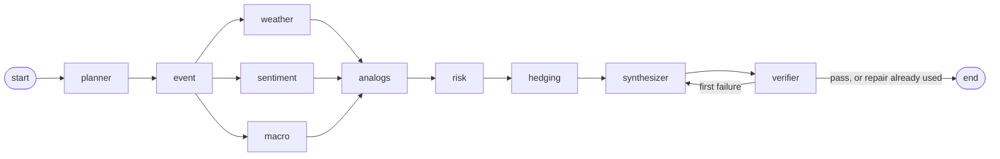
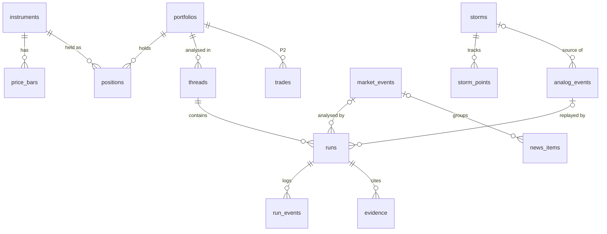

# Tempest: build spec

Financial intelligence terminal for Codeutsav problem statement 5 (`docs/PS5.md`). Build exactly what is written here. Tempest is a working name.

- **(decided)** = chosen by the team. **(default)** = recommended default; follow it unless the team changes it, and log every change in `docs/DECISIONS.md`.
- **P0 / P1 / P2** = priority. P0 is the demo path and must work at the hour-12 integration point. P1 completes the problem statement. P2 only if time remains.
- Do not build anything from the cut list (section 12).
- Assumptions: 24-hour build, team of 2 to 4, desktop web only, one demo portfolio, paper trading only, local demo (hosted deploy is optional).
- Language: TypeScript on Node.js everywhere (apps, packages, scripts, tests). No Python.
- Execution order, owners and gates are in `docs/ROADMAP.md`.

---

## 0. What changed in v2

v1 was built around Gulf hurricanes. The problem statement uses the hurricane only as an example ("For example: ..."), and asks for global news, geopolitical events and cross-asset impact. v2 makes the **market event** the centre of the design; a hurricane is one event type among eight.

| Area | v1 | v2 |
|---|---|---|
| Scope | Gulf hurricanes and an energy fund | Any market-moving event (section 5.14) and a multi-sector fund (section 11) |
| Universe | 17 energy symbols + 4 factors | 37 tradable symbols across 12 sectors + 4 FRED factors |
| News ingestion | 3 GDELT queries, all hurricane-scoped | One GDELT query per event type plus company-name queries; keyword prefilter before scoring and indexing (5.2) |
| Graph | 9 nodes; weather always central | 10 nodes: new `event` node; `weather` runs only for weather disasters (5.5) |
| Forecast | kNN on storm features, 3 commodity targets | kNN on event type, news, regime and (for storms) weather features; forecasts every holding (5.9) |
| Risk | Commodity betas, refiner capacity elasticity | Factor betas (market, oil, gas, gasoline, gold, rates, dollar) and three exposure channels: direct, peer, factor (5.10, 5.14) |
| Historical events | Hurricanes + 6 parallels | Hurricanes + at least 30 curated events across all types, each with a source URL (10) |
| Replay presets | 4 hurricanes | 6 events, one per main type (5.12) |
| Backtest | Hurricanes only | All events, pooled and per type, against type-only, news-only, regime-only and weather-only baselines (9.1) |
| Live mode | NHC storms | Live event detection from news clusters (P1); NHC stays for storms |

Unchanged: as-of discipline, evidence ledger and the no-digits rule, LLM rules, streaming, source robustness, hedge limits, the stack.

`packages/contracts` v1 (merged in Phase 0) needs a v2 pass before the tracks start: see `docs/ROADMAP.md` Phase 0b.

---

## 1. Project

A terminal for a portfolio manager. The user asks a question in plain English about anything that moves markets: "How will the Russian invasion of Ukraine affect our portfolio?", "What does the new US tariff package mean for our tech holdings?", "Our competitor just had a refinery explosion: what is our exposure?", "How will the forecasted Category 4 hurricane in the Gulf of Mexico affect our current energy holdings?". A LangGraph.js graph of specialised agents identifies the event, reads live and historical data (news and its sentiment, macro series, prices, and storm tracks when the event is a storm), retrieves similar past events from Pinecone, maps how the event reaches each holding, computes portfolio risk, proposes hedges, and answers in the style of the problem statement. Every number in the answer links to the source row or the deterministic computation that produced it.

**Demo story.** Live mode first: the event feed shows events detected from the news stream, each with the holdings it touches. Then replay the Russian invasion of Ukraine as of the day after it began and ask how it affects the portfolio. The graph lights up step by step; the answer names the exposure channels (defense and energy up, airlines and China exposure down), the forecast move per holding from similar past events, the portfolio scenario loss, and a hedge plan with before/after risk. A drilldown shows every evidence row. Then the problem statement's own hurricane question on the Hurricane Ida replay shows the weather agent at work. A reliability page shows the combined model against single-source baselines, per event type.

**Context that shapes the design.** The hackathon runs over a weekend, so US markets are closed: prices are end-of-day only. The live part of the terminal is news and weather. A large event may not happen on demo day, so replay mode (any past timestamp, no look-ahead) and hypothetical events ("what if OPEC+ announces a surprise cut tomorrow?", "what if a Category 4 hits Port Arthur in 48 hours?") are first-class.

## 2. Requirements

**Functional**

1. **P0** Ingest and index: news (GDELT across every event type, Alpha Vantage), weather (NHC, HURDAT2, Open-Meteo), commodity and macro series (FRED), daily prices (Tiingo). News text that passes the prefilter is embedded and indexed in Pinecone.
2. **P0** Multi-agent engine (LangGraph.js): planner, event resolver, weather impact, news sentiment, macro regime, historical analogs, quant risk, hedging and execution, synthesizer, verifier.
3. **P0** Historical parallels: the analogs agent queries Pinecone for similar past events of any type and their cross-asset reactions.
4. **P0** Analysis: event classification and exposure channels (direct, peer, factor), news sentiment (Claude-scored, Alpha Vantage scores, GDELT tone), macro regime flags (FRED), quant risk (betas, correlations, VaR/CVaR, scenario and analog P&L) across equities, ETFs and commodity factors.
5. **P0** Natural-language queries produce hedging strategies, reallocation proposals with execution notes, and a risk assessment. Follow-up questions continue the same thread.
6. **P0** Terminal: live agent graph, event card, answer with evidence chips, hedge table, drilldown audit, portfolio panel with exposure badges. **P1**: live event feed, storm map, price and weather charts, live news feed, risk breakdown chart, data-source health.
7. **P0** Replay mode: any query can run as of a past timestamp with no look-ahead; six showcase presets across event types.
8. **P1** Live event detection: clusters of related news become events with type, entities and affected holdings.
9. **P1** Reliability report: leave-one-out backtest of the combined model against type-only, news-only, regime-only, weather-only and unconditional baselines, pooled and per event type.
10. **P2** "What happened next" panel (replay only), apply a hedge plan to the paper portfolio, printable audit report.

**Non-functional** (each has a measurement in section 9)

1. **Ingestion latency (P1):** per batch, p95 under 1 s from the upstream response being received to the Postgres write and the Pinecone upsert both being acknowledged (`fetched_at` to `indexed_at`). Time until a record becomes searchable (Pinecone is eventually consistent) is measured and reported separately, never claimed as part of this number.
2. **Orchestration accuracy:** an eval set of 20 queries checks plan intent, event type, specialist selection, verifier pass and hedge-constraint pass. Rates are reported.
3. **Forecast reliability:** leave-one-out backtest over every historical event (Gulf hurricanes 2017 to 2025 and the curated events from 2017 onward). Directional accuracy, MAE and Spearman correlation for combined vs single-source baselines, pooled and per type with n. The result is reported as measured, whatever it is.
4. **Auditability:** every number in an answer is an evidence placeholder resolved from the run's ledger. Every evidence row has source, source reference, as-of time, basis and producing node. Every step is persisted with inputs, outputs, model, tokens, latency and cost.
5. **Robustness:** rate limits, missing streams and LLM failures never crash a run. The run completes with degraded steps, explicit caveats and lowered confidence, and never with invented numbers. One run reads one consistent as-of snapshot.
6. **Responsiveness:** first run event under 1 s after submit; full run p50 under 45 s and p95 under 90 s over the eval set.
7. **Cost:** under $0.25 of LLM spend per run, logged per run. News enrichment under $2 per day (`ENRICH_DAILY_MAX`).

## 3. Monorepo structure (decided)

The repository already contains the team template (Turborepo + pnpm, `@repo/*` scope, Express + tRPC + trpc-to-openapi + Scalar, Next.js + shadcn/ui, Drizzle). Keep its layout, tooling and naming. **NEW** marks additions.

**Remove from the template:** `packages/services/clients/google-oauth.ts`, `packages/services/user/`, `packages/trpc/server/routes/auth/`, `packages/database/models/user.ts` and its migration (regenerate the first migration), the `google-auth-library` dependency, and the "Streamyst" strings.

```
.
├── apps
│   ├── api                          Express: /trpc (incl. SSE subscriptions), /api (REST), /openapi.json, /docs
│   │   └── src                      Runs the agent graph in-process
│   │       ├── env.ts               PORT (8000), NODE_ENV, BASE_URL, CORS_ORIGIN, DEMO_TOKEN (optional)
│   │       ├── server.ts            template + CORS from CORS_ORIGIN
│   │       └── index.ts             listen; on boot mark runs left `running` as failed; start the live relay
│   ├── worker                       NEW  BullMQ ingestion, enrichment and event detection
│   │   └── src
│   │       ├── env.ts
│   │       ├── index.ts             queues, job schedulers, workers, graceful shutdown
│   │       └── jobs                 gdelt.ts, alphavantage.ts, nhc.ts, openmeteo.ts, fred.ts, tiingo.ts, enrich.ts, detect.ts
│   └── web                          Next.js App Router + shadcn/ui + Tailwind, dark terminal theme
│       ├── app
│       │   ├── layout.tsx, globals.css, page.tsx          the terminal
│       │   ├── reliability/page.tsx                        NEW  P1 backtest report
│       │   └── runs/[runId]/page.tsx                       NEW  P2 printable audit report
│       ├── components
│       │   ├── ui/                  shadcn/ui (template)
│       │   └── terminal/            NEW  section 8
│       ├── hooks/                   use-mobile.ts + NEW use-run-stream.ts, use-live-feed.ts
│       ├── providers/global.tsx     dark theme by default
│       └── trpc/                    client.ts, server.ts, create-client.ts (+ splitLink to httpSubscriptionLink)
├── packages
│   ├── contracts                    NEW  browser-safe: Zod schemas, enums, constants, formatters, fixtures
│   │   ├── schemas/                 market, news, weather, macro, event, analog, portfolio, evidence, agents, runs, live
│   │   ├── constants.ts             section 11 and the constants named in sections 5 and 5.14
│   │   ├── format.ts                unit formatting and placeholder rendering (server and web)
│   │   ├── fixtures/                complete Ukraine and Ida runs as RunEvents, portfolio, news, events, storm (for UI work)
│   │   └── index.ts
│   ├── database
│   │   ├── models/                  one file per table (section 6)
│   │   ├── schema.ts, index.ts, env.ts, drizzle.config.ts, drizzle/
│   ├── services                     all I/O
│   │   ├── clients/                 http.ts (5.3), redis.ts, pinecone.ts, anthropic.ts,
│   │   │                            tiingo.ts, fred.ts, gdelt.ts, alphavantage.ts, nhc.ts, openmeteo.ts
│   │   ├── llm/                     the only code that calls the Anthropic API (5.7)
│   │   ├── market/ macro/ news/ events/ weather/ analogs/ portfolio/ runs/ ingest/ system/
│   │   │                            each: model.ts (Zod, types) + index.ts (service class, template pattern)
│   │   ├── queues/index.ts          BullMQ queue names, payload schemas, producers
│   │   └── env.ts                   shared variables; clients validate their own lazily
│   ├── quant                        NEW  pure math: no I/O, no clock, no unseeded randomness
│   │   ├── series.ts                date alignment, log returns, windows
│   │   ├── stats.ts                 mean, std, OLS beta and R², correlation, Spearman, weighted stats, z-scores
│   │   ├── risk.ts                  VaR/CVaR, scenario P&L, analog replay P&L
│   │   ├── exposure.ts              NEW  exposure channels (direct, peer, factor), exposed sleeve
│   │   ├── hedge.ts                 min-variance hedge ratio, sizing, constraint checks, simulate
│   │   ├── geo.ts                   haversine, track interpolation, capacity at risk
│   │   ├── forecast.ts              feature z-scoring, grouped kernel kNN forecast
│   │   ├── detect.ts                NEW  news clustering and severity rules (5.14)
│   │   ├── backtest.ts              leave-one-out harness and metrics
│   │   └── *.test.ts
│   ├── agents                       NEW  LangGraph.js graph
│   │   ├── graph.ts                 state, nodes, edges, compile with PostgresSaver
│   │   ├── context.ts               RunContext registry, instrumentNode wrapper
│   │   ├── ledger.ts                evidence ledger: add, get, render
│   │   ├── verify.ts                grounding and constraint checks
│   │   ├── fallbacks.ts             rule-based plan, keyword event classifier, fallback hedge, template answer
│   │   ├── nodes/                   planner, event, weather, sentiment, macro, analogs, risk, hedging, synthesizer, verifier
│   │   ├── prompts/                 one system prompt per LLM call
│   │   └── *.test.ts                graph tests with a fake LLM
│   ├── trpc
│   │   ├── server
│   │   │   ├── trpc.ts, context.ts  template; context carries the request's demo token
│   │   │   ├── routes/              health, system, portfolio, market, news, events, weather, macro, analogs, runs, live, backtest;
│   │   │   │                        each route file creates the service instances it needs
│   │   │   └── index.ts             serverRouter
│   │   └── client/index.ts          router types + @trpc/client re-exports (template)
│   ├── logger, eslint-config, typescript-config      template
├── scripts                          NEW  tsx: seed.ts (+ seed/*.ts), backtest.ts, eval-queries.ts, ingest-bench.ts, drills.ts,
│                                         run-query.ts (one run from the CLI), stream-run.ts (print a run's events)
├── data
│   ├── seed/                        NEW  committed: refineries.geojson, refinery-tickers.json, analog-events.json
│   ├── eval/queries.json            NEW  committed
│   └── cache/                       NEW  gitignored raw API responses (share as a zip inside the team)
├── docker-compose.yml               postgres (template) + NEW redis
└── turbo.json, pnpm-workspace.yaml, package.json, NEW vitest.config.mts
```

**Dependency rules** (enforced with `no-restricted-imports`)

1. Apps depend on packages. Packages never import from apps.
2. `web` imports only `@repo/contracts` and types from `@repo/trpc/client`.
3. `quant` imports only `@repo/contracts`. It never reads the clock or does I/O, so every function is deterministic and unit-testable.
4. `services` own all I/O: Postgres, Redis, Pinecone, HTTP, Anthropic. `database` imports no internal package.
5. `agents` import `services`, `quant` and `contracts`. Only `services/llm` calls the Anthropic API; the worker's news scoring uses the same module.
6. tRPC routes validate with `contracts` schemas, call a service or `agents.startRun`, and return. No business logic in routes.
7. LLM-written text never contains numbers. Numbers come from the evidence ledger (5.6).
8. Every data read takes `asOf` (5.1).
9. Each app and package validates its environment with Zod at startup; service clients validate their own variables on first use, so the api does not need worker-only keys and the reverse.

**Service domains** (`packages/services`, class per domain as in the template's `UserService`)

| Domain | Functions |
|---|---|
| market | `instruments`, `bars(symbol, from, asOf)`, `closesAt(symbols, asOf)`, `returns(symbols, lookback, asOf)`, `adv(symbol, asOf)`, `realized(symbols, asOf, horizonDays)` |
| macro | `snapshot(asOf)`, `series(id, from, asOf)` |
| news | `upsertBatch(items)`, `search(text, { asOf, windowHours, tickers, eventTypes })`, `list(filters)`, `scoreUnscored(limit)`, `typeCounts(asOf, days)`, `newsFeatures(query, windowStart, windowEnd)` (5.9) |
| events | `active(asOf)`, `get(id)`, `detect(asOf)` (P1, 5.14), `profileFromNews(query, asOf)`, `buildEventQuery(profile)` (5.9) |
| weather | `stormsAt(asOf)`, `track(stormId, asOf)`, `hypotheticalTrack(params, asOf)`, `refineries()`, `hubForecasts()` |
| analogs | `search(text, { types, asOf, topK })`, `get(ids)`, `list()` |
| portfolio | `snapshot(portfolioId, asOf)` |
| runs | `create`, `appendEvent`, `addEvidence`, `complete`, `get`, `list`, `eventsAfter(runId, seq)` |
| ingest | `runSource(name)` (fetch, validate, normalize, dedupe, prefilter, persist and index, publish), `status` |
| system | `sourceStatus()`, `ingestLatency(windowHours)`, `ingestNow(sources)` |
| llm | `parseStructured`, `runTools`, usage and cost accounting |

## 4. Stack

| Layer | Choice | Status | Notes |
|---|---|---|---|
| Monorepo | pnpm + Turborepo, tsup for Node apps | decided | The template |
| Frontend | Next.js App Router, shadcn/ui, Tailwind, Recharts (template `chart.tsx`), React Flow (`@xyflow/react`), `react-leaflet` with OpenStreetMap tiles | decided | Desktop layout, dark theme |
| API | Express + tRPC v11 at `/trpc`, REST via `trpc-to-openapi` at `/api`, Scalar at `/docs` | decided | Template. Subscriptions use SSE (`httpSubscriptionLink`), no WebSocket server |
| Orchestration | LangGraph.js (`@langchain/langgraph`) + `@langchain/langgraph-checkpoint-postgres` | decided | Fixed graph, thread memory for follow-ups |
| LLM | Claude through `@anthropic-ai/sdk`: `claude-sonnet-5-5` for planner, hedging, synthesizer; `claude-haiku-4-5` for news scoring, event classification and specialist notes | decided | Rules in 5.7 |
| Vector database | Pinecone serverless, integrated embedding `llama-text-embed-v2` | decided | Rules in 5.4 |
| Database | Postgres + Drizzle | decided | Template |
| Queue, cache, pub/sub | One Redis (`maxmemory-policy noeviction`) + BullMQ | decided | Ingestion schedules, per-source rate limits, response cache, live relay |
| Validation | Zod (template version) | decided | All shared shapes live in `@repo/contracts` |
| Tests | Vitest | decided | Known-answer tests for `quant`, fixture tests for clients, fake-LLM graph tests |
| Scripts | `tsx` | default | Seeds, backtest, eval, bench, drills |
| Hosting | Local demo. Optional: Railway (api, worker, Postgres, Redis) + Vercel (web) | default | P2 |

**External data sources** (limits are as published at the time of writing; confirm in the first hour, see ROADMAP section 2)

| Source | Used for | Key | Free limit | Schedule | Notes |
|---|---|---|---|---|---|
| Tiingo | Daily OHLCV and adjusted close for the 37 Tiingo symbols since 2015 | `TIINGO_API_KEY` | 50 requests/hour, 1,000/day, 500 symbols/month | Seed once; daily at 22:30 UTC on weekdays | Licence forbids redistribution: never commit Tiingo data |
| FRED | Commodity spot factors and macro series | `FRED_API_KEY` | Generous | Seed once; every 6 hours | Missing values arrive as `"."` |
| Alpha Vantage `NEWS_SENTIMENT` | Finance news with per-ticker sentiment | `ALPHAVANTAGE_API_KEY` | 25 requests/day | Hourly, at most 24/day, rotating through `AV_ROTATION` | Throttling returns HTTP 200 with an `Information` or `Note` body. Price endpoints are not used (full history is premium) |
| GDELT DOC 2.0 | Global news (`artlist`), tone and volume timelines | none | About 1 request per 5 s | Every 15 minutes, one pass over `NEWS_QUERIES` | Timeline modes reach back to 2017. `artlist` returns at most 250 records and only the last 3 months of any window |
| NHC `CurrentStorms.json` + NOAA tropical MapServer | Active storms, forecast points | none | — | Every 10 minutes | Send a `User-Agent` with a contact address. Look up MapServer layers by name, not id |
| HURDAT2 | Historical tracks for hurricane events, replay and backtest | none | — | Seed once | Newest `hurdat2-1851-*.txt` on nhc.noaa.gov/data |
| Open-Meteo | Wind gust and precipitation forecast at refining hubs | none | Non-commercial, 10,000 calls/day | Hourly | All hubs in one multi-location call |
| EIA Energy Atlas | Refinery locations and capacity | none | — | Seed once (committed GeoJSON) | Public domain |
| Pinecone | Vector index | `PINECONE_API_KEY` | Starter: 2 GB, 1M read units, 2M write units, 5M embedding tokens per month; AWS us-east-1 only | — | Reranking is not used (500 requests/month quota). Only prefiltered news is embedded, to stay inside the embedding quota |
| Anthropic | LLM | `ANTHROPIC_API_KEY` | Account limits | — | |

**Environment variables, by owner**

| Owner | Variables |
|---|---|
| `packages/database` | `DATABASE_URL` |
| `packages/services` | `REDIS_URL`, `PINECONE_API_KEY`, `PINECONE_INDEX` (default `tempest`), `ANTHROPIC_API_KEY`, `MODEL_REASONING` (default `claude-sonnet-5-5`), `MODEL_FAST` (default `claude-haiku-4-5`), `TIINGO_API_KEY`, `FRED_API_KEY`, `ALPHAVANTAGE_API_KEY`, `NOAA_USER_AGENT` (for example `tempest-codeutsav (team@example.com)`), `DISABLE_SOURCES` (comma list, drills only) |
| `apps/api` | `PORT` (8000), `NODE_ENV`, `BASE_URL`, `CORS_ORIGIN` (`http://localhost:3000`), `DEMO_TOKEN` (optional; required on `runs.create` and `system.ingestNow` when set) |
| `apps/worker` | `SCHEDULES_ENABLED` (default `true`), `DETECTION_ENABLED` (default `true`) |
| `apps/web` | `NEXT_PUBLIC_API_URL` (`http://localhost:8000/trpc`) |

## 5. Architecture rules (decided)

### 5.1 As-of discipline (no look-ahead)

Every read takes `asOf`. A live run uses the run start time; a replay run uses the preset or user value. One run reads one snapshot, so numbers cannot shift while it runs.

- A daily bar dated D becomes available at D 21:00 UTC (`barAvailableAt` in `contracts/format.ts`). Reads return bars with `date + 21h <= asOf`.
- FRED daily series follow the same rule. FRED weekly series (inventories) become available at the observation date plus 5 days.
- News: `published_at <= asOf` and `published_at >= asOf - NEWS_WINDOW_HOURS` (72).
- Market events (5.14): only events with `first_seen_at <= asOf`, with counts and z-scores recomputed from news visible at `asOf`.
- Storms: observed points with `valid_at <= asOf`. Forecast points: live uses the latest advisory with `issued_at <= asOf`; replay uses the best track for the next 72 hours, labelled "perfect-forecast replay" (5.12).
- Analog events: only events whose realized window ends before `asOf` (`realized_until < asOf`). A replay can never see its own event's outcome or any later event.
- A replay preset reads only the pre-outcome fields of its own analog row: name, type, subtype, `first_report_at`, entities and sources. Never `reactions` or `features` computed after `asOf`.
- A test asserts that, for `asOf = 2021-08-27T21:00Z` and for the Ukraine preset `asOf`, no service returns a row dated later than that (labelled replay forecast points excepted).

### 5.2 Ingestion pipeline

Stages: BullMQ job scheduler per source, fetch through the HTTP wrapper (5.3), Zod validation, normalisation to `contracts` types, de-duplication (news by URL; bars, observations and storm points by primary key), prefilter (news only), then in parallel the Postgres write and the Pinecone `upsertRecords` (batches of at most 96, prefiltered news only), then `indexed_at`, then a `LiveEvent` on the Redis channel `live`, then an `enrich` job for new prefiltered news ids.

- **Latency:** `fetched_at` is when the upstream response body is fully received; `indexed_at` is when both writes resolved. Both are stored on every news item, so latency is a SQL query over indexed items.
- **Queries:** `NEWS_QUERIES` is a record keyed by event type (5.14) plus `company` queries built from `TICKER_ALIASES` and `EXTERNAL_PEERS`, chunked so each query stays under GDELT's length limit. One GDELT pass runs every 15 minutes (about 12 queries at 1 per 5 s). Tone and volume timelines use each event's own `gdelt_query` (5.9), never these collection queries. Alpha Vantage rotates hourly through `AV_ROTATION` (topic filters and ticker groups).
- **Prefilter** (rule-based, fast, in the sub-second path): an item passes if its title or summary matches `TICKER_ALIASES`, `EXTERNAL_PEERS` or `EVENT_KEYWORDS[type]`, or Alpha Vantage tagged it with a universe ticker. Every item goes to Postgres with `prefilter_match`; only passing items are embedded and scored.
- **Ticker tagging** at ingest: alias matches give `tickers` (universe symbols named directly); `EXTERNAL_PEERS` matches give `peer_tickers` (universe symbols whose competitor is named).
- **Enrichment** (`enrich` queue, concurrency 2, at most `ENRICH_DAILY_MAX` items per day): batches of up to 20 prefiltered, unscored items go to Haiku for structured scoring: sentiment -1 to 1, relevance 0 to 1, event type (5.14 or `none`), entity tickers from the universe only, per-entity sentiment, and factor directions (`up`, `down` or `unclear` per factor in `FACTORS`). Updates the row and publishes `news.scored`. Not part of the sub-second path.
- **Detection** (P1, `detect` queue, every 15 minutes): see 5.14.
- **Manual trigger** (P1): `system.ingestNow` queues an immediate GDELT and NHC job (and Alpha Vantage if quota remains). Used in the demo to show latency live.

### 5.3 Source robustness

`services/clients/http.ts` wraps every external call:

1. Timeout 10 s (`AbortSignal.timeout`).
2. Two retries on network errors and 5xx, with jittered backoff (about 0.5 s, then 1.5 s).
3. HTTP 429, or a provider throttle body (Alpha Vantage `Information`/`Note`), raises `RateLimitedError(retryAfterMs)`. Jobs turn it into a queue rate limit instead of retrying.
4. Every response is validated with Zod; a failure raises `BadPayloadError` and logs a 200-character sample.
5. Circuit breaker per source: 3 consecutive failures open it for 5 minutes; calls then fail fast with `SourceDownError`. `DISABLE_SOURCES` forces this state (drills).
6. Cache: `cached(key, ttlSeconds, fn)` in Redis, plus a stale copy kept 24 hours. When a call fails and a stale copy exists, it returns `{ data, stale: true }`.
7. Status per source in the Redis hash `source:{name}`: `status` (ok, degraded, rate_limited, down), `lastOkAt`, `lastErrorAt`, `lastError`, `lastLatencyMs`.

Quotas: Alpha Vantage daily counter `quota:alphavantage:{yyyy-mm-dd}` stops at 24. Tiingo limiter 45 per hour. GDELT limiter 1 per 5 s. Enrichment counter `quota:enrich:{yyyy-mm-dd}` stops at `ENRICH_DAILY_MAX`. In a run, services return `{ data, stale }` or `{ unavailable: reason }`; nodes never substitute invented values.

### 5.4 Vector index (Pinecone)

One integrated-embedding index (`PINECONE_INDEX`), model `llama-text-embed-v2`, field map `{ text: "text" }`, created by `pnpm seed` when missing.

| Namespace | Record | Id | `text` | Metadata (flat values only) |
|---|---|---|---|---|
| `news` | one per prefiltered news item | `n_<sha1(url)>` | title + ". " + summary, at most 1,500 characters | `source`, `publishedAt` (unix seconds), `tickers` (string list), `peerTickers` (string list), `eventTypes` (string list, after scoring), `topics` (string list) |
| `events` | one per analog event | `e_<eventId>` | generated description (section 10.5) | `type`, `subtype`, `t0` and `realizedUntil` (unix seconds), `entities` (string list), `region` |
| `weather` (P2) | one per NHC discussion paragraph | `w_<stormId>_<advisory>_<i>` | paragraph | `stormId`, `issuedAt` (unix seconds) |

- Search with `searchRecords` and a metadata `filter` (time range, `type`, `tickers` or `entities` with `$in`). Pinecone returns ids and scores; Postgres holds the full rows.
- No reranking. Seeds wait until namespace counts are visible before evals run.

### 5.5 Agent graph (LangGraph.js)

The graph has the same shape on every run, so the UI graph is stable:



| Node | Job | LLM | Writes |
|---|---|---|---|
| `planner` | Turn the question, thread history, portfolio summary, mode, active market events and active storms into a `Plan`: intent (`event_impact`, `portfolio_risk`, `hedge`, `what_if`, `news_scan`, `explain`, `out_of_scope`), event source (`live`, `replay`, `hypothetical` or `none`), event hint (type, name, entities) or hypothetical parameters, focus symbols and sectors, horizon (default 5 trading days), which specialists are needed, whether reallocation was asked for. Fallback: keyword rules in `fallbacks.ts` | Sonnet, effort low, structured | `plan` |
| `event` | Resolve and profile the event (5.14): live from `market_events` or a news search, replay from the preset, hypothetical from the plan. Builds the `EventProfile`: type, subtype, title, first report time, entities, peer symbols, affected sectors, factor directions, article and domain counts, news volume and tone z-scores, severity. For `news_scan`, up to 3 profiles ranked by exposed value; the top one drives `weather`, `analogs`, `risk` and `hedging`, and the answer lists the other two with their exposure only. Fallback: keyword classifier in `fallbacks.ts` | Haiku, structured (classification only, when the event comes from a news search) | `event` |
| `weather` | Runs only when the event is a weather disaster (`disaster` with subtype `hurricane`, `tropical_storm` or `winter_storm`) or the plan asks for weather; otherwise `skipped`. Resolve the storm, build its track, compute capacity at risk for the Gulf Coast and per company, read hub forecasts (live only). Rules in 5.8 | Haiku note | `weather` |
| `sentiment` | Search Pinecone `news` at `asOf` with the event profile and per holding; score unscored hits; aggregate per-holding, per-peer-group and per-sector sentiment (relevance-weighted, 24-hour recency half-life); report the event profile's `volZ` and `toneZ` (computed once by the `event` node, 5.9) | Haiku note (and scoring) | `sentiment` |
| `macro` | FRED snapshot: VIX level (calm below 18, elevated to 25, stressed above) and its z-score, 10-year yield and dollar index 20-day change, fed funds level; gasoline and crude inventories against their 5-year same-week average (tight below -3%, loose above +3%) when the portfolio has energy exposure | Haiku note | `macro` |
| `analogs` | Search Pinecone `events` with a description built from the event profile (same template as 10.5); grouped kernel kNN forecast for `FORECAST_TARGETS` and every holding (5.9); cross-asset reaction table of the top analogs; top 3 same-type and top 3 other-type parallels | Haiku note | `analogs` |
| `risk` | Portfolio snapshot, factor betas, correlations, exposure channels per holding (5.14), VaR/CVaR, scenario and analog P&L (5.10) | none | `risk` |
| `hedging` | Hedge and reallocation plan with execution notes through two tools (5.11). Fallback: min-variance hedge against the exposed sleeve | Sonnet, effort medium, tool runner | `hedgePlan` |
| `synthesizer` | Final `Answer` with evidence placeholders (5.6). Fallback: template answer | Sonnet, effort medium, structured | `answer` |
| `verifier` | Grounding and constraint checks (5.6); routes to repair or end | none | `verification` |

A "Haiku note" is 1 to 3 short findings, each a placeholder template with evidence keys, written from the node's computed output. The numbers a node produces never come from its note.

**Rules**

1. Parallel nodes write disjoint state keys. Only `history` uses an append reducer (one `{ runId, query, headline }` per run). The planner resets the per-run keys at the start of each run.
2. A node that the plan or the event does not need returns status `skipped`; the graph shape never changes.
3. `RunContext` (`runId`, `asOf`, `mode`, `portfolioId`, ledger, `emit`, abort signal) lives in an in-process registry keyed by `runId`. The graph receives only `runId` through `configurable`; nothing non-serializable enters state or checkpoints.
4. `instrumentNode(name, fn)` wraps every node: emits `step.started` and `step.completed` or `step.failed` with duration, LLM usage and the thinking summary. A thrown error becomes a degraded output `{ status: "unavailable", reason }` and the graph continues. Nothing aborts a run except cancellation.
5. Thread memory: compile with `PostgresSaver` (schema `langgraph`, `setup()` once at api start); `thread_id` is `threads.id`. Follow-ups see `history` and the previous `plan`, `event` and `weather`, so "what if it only reaches Category 2?" or "what if sanctions are lifted next month?" reuses the event with an override.
6. The graph runs inside `apps/api` (one instance). At most 2 runs at a time; a third gets `TOO_MANY_REQUESTS`. On boot, runs left `running` become `failed` with "server restarted".
7. Confidence is computed, not written by the LLM: start at high; drop one level for each core input (event profile, sentiment, analogs, and weather when the event is a weather disaster) that is unavailable or stale, and when the analog effective sample size is below 4; never above medium for hypothetical events or for event types with fewer than `MIN_TYPE_EVENTS` (5) historical events.

### 5.6 Evidence ledger and numeric grounding

The rule that makes the problem statement's "without hallucinating financial metrics" checkable: **the LLM never types a number.**

- Every value that may appear in an answer, a hedge rationale or a chart caption is an evidence row created with `ledger.add(...)` by the node that read or computed it. Keys are `E1`, `E2`, ... per run.
- Evidence fields: `kind` (price, news, event, weather, macro, analog, computation, model, assumption, portfolio), `label`, `value` or `textValue`, `unit`, `basis` (observed, computed, model, assumption), `source`, `sourceRef` (URL, series id, advisory, formula), `asOf`, `stale`, `producedBy`, `payload` (inputs of a computation, for example the list of refineries summed or the news ids counted).
- LLM-written strings reference evidence as `{{E12}}`. They contain no digits outside placeholders (allowlist: `NUMERIC_ALLOWLIST`, for example `S&P 500`, `OPEC+`, `G7`).
- `contracts/format.ts` formats by unit: `pct` (fraction to "40%"), `pct_signed` ("+8.1%"), `usd` ("$1.2M"), `kt`, `bpd` ("1.25M b/d"), `days`, `score` (2 decimals), `z` (1 decimal), `ratio`, `count`, `category` ("4"), `date` ("Aug 29, 2021"), `text` (`textValue`).
- The server stores the template and the rendered text. The UI renders the template as chips (formatted value; hover shows label, source and as-of; click opens the evidence row).
- Numbers typed by the user ("Category 4", "a 25% tariff") become evidence with basis `assumption` and source `user`. Sentiment scores, event types and factor directions are model outputs: basis `model`, `sourceRef` = model id.

**Verifier checks**

1. Every placeholder exists in the run's ledger.
2. No digits outside placeholders in any LLM-authored field: answer, bullets, caveats, hedge summary, rationales, exit triggers.
3. Every hedge action passes the limits in 5.11 and cites at least one evidence key; every answer bullet cites at least one.
4. Only universe symbols appear.
5. Caveats mention every unavailable or stale input; missing ones are appended deterministically.

On failure the synthesizer gets one repair attempt with the violation list. A second failure produces the deterministic template answer from structured data, and the run ends `partial`.

### 5.7 LLM usage (decided)

- All calls go through `services/llm`, with `new Anthropic({ maxRetries: 2, timeout: 60_000 })`.

| Call | Model | Effort | Output | `max_tokens` |
|---|---|---|---|---|
| planner | `MODEL_REASONING` | low | `Plan` | 4,000 |
| event classification | `MODEL_FAST` | none | `EventClassification` | 2,000 |
| specialist notes (4) | `MODEL_FAST` | none | `Notes` | 2,000 |
| news scoring | `MODEL_FAST` | none | `Scores` | 4,000 |
| hedging | `MODEL_REASONING` | medium | tool loop ending in `submit_plan` | 16,000 |
| synthesizer | `MODEL_REASONING` | medium | `Answer` | 16,000 |

- Structured output: `client.messages.parse` with `output_config.format` built by the SDK's Zod helper (`zodOutputFormat`). Never forced `tool_choice` (`any` or `tool` returns 400 on `claude-sonnet-5-5`); tools are defined with `strict: true` and the prompt says when to call them.
- Sonnet thinking stays adaptive (the default) with `display: "summarized"`; the summary is stored on the step for the drilldown. Never ask the model to write its reasoning as text.
- Set `output_config.effort` explicitly on Sonnet (its default is high). Do not send `temperature`, `top_p` or `top_k` to Sonnet. Haiku gets no effort and no thinking; `temperature: 0`.
- Check `stop_reason` before reading content. `refusal`: the node degrades and logs `stop_details.category`. `max_tokens`: one retry with double the limit, then degrade.
- Server-side fallback on Sonnet calls: `fallbacks: "default"` with the beta `server-side-fallback-2026-07-01`, if the installed SDK's parse and tool-runner calls accept it; otherwise omit it and log that in `docs/DECISIONS.md`.
- Prompts: one stable system prompt per call in `agents/prompts/`, data as JSON in the user message, the evidence-key list, the no-digits rule, the allowed symbols, the event-type list. Put `cache_control` on the system block (it is ignored when the prompt is below the cache minimum).
- Usage: input and output tokens per call; cost from `MODEL_PRICES` (USD per million tokens: Sonnet 5.5 $2 in / $10 out, Haiku 4.5 $1 / $5); totals stored on the run.

### 5.8 Weather impact model

Applies only to weather disasters (5.5, `weather` node). The rest of the graph does not depend on it.

**Storm resolution** (weather node)

1. Replay: HURDAT2 storms with an observed point in the 12 hours before `asOf`; pick the one named in the question, else the one whose latest point is inside `GULF_BOX` (18-31°N, 98-80°W).
2. Live: NHC active Atlantic storms; pick by name, else the one inside or forecast into `GULF_BOX`.
3. Hypothetical: from the plan (5.12).
4. None: status `unavailable`, reason "no active Gulf storm at as-of"; the run continues with the other agents.

**Track:** observed points up to `asOf` plus forecast points. Live forecast points come from the NOAA MapServer layer `<bin> Forecast Points` for the storm's `binNumber`; if that fails, a 48-hour persistence track from the storm's movement direction and speed, labelled. Replay uses the next 72 hours of best track, labelled.

**Impact:** forecast points (and observed points from the last 12 hours) with wind at least 64 kt, interpolated to 1-hour steps. A refinery is at risk if it lies within `IMPACT_RADIUS_KM` (100) of any impact point (haversine).

**Outputs** (all evidence): storm name, current and peak forecast category (Saffir-Simpson in knots: Cat 1 64-82, Cat 2 83-95, Cat 3 96-112, Cat 4 113-136, Cat 5 137+), landfall time and nearest `LANDFALL_REGIONS` anchor (replay: HURDAT2 `L` record; live: first forecast point within 50 km of the coast anchors), number of refineries at risk, Gulf Coast capacity at risk (at-risk capacity over the PADD 3 total), per-company capacity at risk (at-risk capacity over the company's total US capacity), the at-risk refinery list (payload), and, live only, the maximum gust in the next 120 hours at each hub in `HUBS`. Companies with capacity at risk join the event's `entities`, so they get the direct exposure channel (5.14).

Known limit, stated in caveats when relevant: the model uses wind distance only and ignores flooding (Harvey 2017 hurt refineries mostly through rain).

### 5.9 Forecast model

**Targets:** 5-trading-day forward log return from the last close at or before `asOf` of every holding and of `FORECAST_TARGETS` (`SPY`, `WTI`, `GULF_GASOLINE`, `HH_NATGAS`, `GLD`, `TLT`).

**Event features** (z-scored across the event set, except `type`), in groups

| Feature | Group | Defined for | Definition |
|---|---|---|---|
| `type` | type | all | Not a vector and not z-scored: contributes `TYPE_WEIGHT²` (1.5² = 2.25) to the type group's squared distance when the two events' types differ, 0 when they match |
| `volZ` | news | all | GDELT `timelinevol` for the event's `gdelt_query`: mean over the feature window against the mean and std of the 28 days before it |
| `toneZ` | news | all | The same with `timelinetone` |
| `vixZ` | regime | all | VIX (FRED `VIXCLS`) at t0 against its 252-day mean and std |
| `windKt` | weather | hurricanes | Maximum wind of track points in the 24 hours before landfall (or closest approach to the hub centroid) |
| `capAtRisk` | weather | hurricanes | Gulf Coast capacity at risk (5.8) using the event's track |
| `offshoreExposure` | weather | hurricanes | Share of hurricane-force track points inside `OFFSHORE_BOX` (26-29.5°N, 95-88°W) |

**News features, one function for every event.** `newsFeatures(query, windowStart, windowEnd)` in `services/news` reads the two GDELT timelines; the z-score math lives in `quant/stats.ts`. Curated events, hurricanes, replay presets and live events all go through it, so the backtest measures the same features the live model uses. Each event has one `gdelt_query`:

- Curated events: hand-written in `data/seed/analog-events.json`.
- Hurricanes: `("Hurricane <Name>" OR "Tropical Storm <Name>")`, built by the seed.
- Live events (detected or from a news search): `buildEventQuery(...)` ORs the two most frequent entity names from `TICKER_ALIASES` and `EXTERNAL_PEERS` with the type's `EVENT_KEYWORDS`, plus `sourcelang:english`. Their feature window is `[firstReportAt, min(firstReportAt + 24 hours, asOf)]`.
- Hypothetical events: no query; news features come from the plan's severity (5.12).

**Feature window and t0.** Curated events: the feature window is the 24 hours after `first_report_at`; `feature_at` = `first_report_at` + 24 hours; t0 = the last close at or before `feature_at`. Hurricanes keep their v1 rule: t0 = the last close at least 24 hours before landfall, with the news window the 2 days before t0. A forecast is never made from information after t0.

**Model:** grouped Gaussian kernel kNN. Distance is computed over the groups both events have (the weather group only between two hurricanes): `d² = Σ_groups ‖x_g - x_jg‖² / (number of groups used)`; `w_j = exp(-d² / (2h²))`, `h = 1.0` (`KNN_BANDWIDTH`), fixed and never tuned on results. With three groups, a type mismatch multiplies an analog's weight by exp(-0.375), about 0.69, so other-type events still count; the type-only variant (T) shows what same-type events alone predict. Forecast = weighted mean of the analogs' realized returns; spread = weighted std; effective n = `(Σw)² / Σw²`. A holding with realized returns in fewer than 3 analogs (for example a recent listing) uses `β_SPY × forecast(SPY)` and says so.

**Variants:** combined (C, all groups), type-only (T, mean of same-type events), news-only (S), regime-only (M), weather-only (W, hurricanes only), unconditional (N, plain mean of all events).

**Live:** C over every eligible event (5.1). If news features are unavailable, use type and regime and say so; hypothetical events take their news features from the plan's severity (5.12) and use type, regime, that assumed news group and (storms) weather. Evidence: mean and spread per target and per holding, effective n, and the top analogs with similarity, weight and realized 5-day returns. The same functions run the backtest (section 9.1), so the reported reliability is the reliability of the live model.

### 5.10 Risk engine (`packages/quant`)

- **Returns:** daily log returns of Tiingo adjusted closes and FRED factor closes, aligned on common dates. Lookback 252 days for betas and correlations, 504 for VaR.
- **Portfolio snapshot:** NAV $10,000,000; quantity = floor(target weight x NAV / close at `asOf`); the remainder is cash. One rule for live and replay.
- **Factor betas:** univariate OLS of each holding on each factor in `FACTORS` (`MARKET` = SPY, `WTI`, `HH_NATGAS`, `GULF_GASOLINE`, `GOLD` = GLD, `RATES` = TLT, `USD` = UUP), with R².
- **Exposure channels** (`quant/exposure.ts`, rules in 5.14): per holding, which channels connect it to the event and why.
- **Correlations:** holdings and factors, 252 days.
- **VaR and CVaR at 95%:** historical simulation of today's quantities over past returns; 1-day, and 5-day from overlapping 5-day sums.
- **Scenario P&L:** `r_h` = the holding's kNN forecast (5.9); P&L = Σ value_h × (e^r_h - 1). Reported in total, per sector and per channel.
- **Analog replay P&L:** for each top analog where every holding has realized 5-day returns, P&L_i = Σ value_h × (e^r_h,i - 1). Report weighted mean, worst and n.
- **Output:** `RiskReport` plus evidence for NAV, VaR/CVaR, the three largest factor exposures, the exposed value per channel, scenario P&L and analog P&L.

### 5.11 Hedging and execution

- **Menu (`HEDGE_MENU`):** buy or sell SPY, XLE, XOP, CRAK, USO, UNG, UGA, GLD, TLT, UUP, XLK, XLF, KRE, ITA, JETS, XLP, FXI, DBA; sell (reduce) existing holdings. No new single-stock shorts, no options or futures: the commodity ETFs stand in for futures exposure.
- **Limits (`HEDGE_LIMITS`):** gross hedge notional at most 30% of NAV; any one action at most 10% of NAV; notional at most 1% of 20-day average dollar volume; integer quantities above zero.
- **Exposed sleeve:** holdings with at least one exposure channel (5.14); if none, the whole portfolio.
- **Suggestions:** for each menu ETF, the min-variance hedge ratio against the exposed sleeve (252 days) and a capped suggested quantity, passed to the model with evidence keys.
- **Tools** (the node passes name, description, Zod schema and handler to `llm.runTools`, which builds strict `betaZodTool` definitions for the SDK tool runner):
  - `simulate_hedges({ actions })` returns before and after `RiskSnapshot` and any limit violations. Creates no evidence.
  - `submit_plan({ actions, summary })` validates, simulates, stores the plan, creates evidence for the after-metrics, and returns violations if any (the model may resubmit). At most 6 tool iterations.
- **Action fields:** `type` (hedge or reallocation), `symbol`, `side`, `quantity`, `timing` (now, before_event, staged), `orderType` (market, limit), `exitTrigger` (template), `rationale` (template), `evidenceKeys`.
- **Fallback** (no submitted plan, or LLM unavailable): one sell of the menu ETF with the best min-variance fit to the exposed sleeve, sized by the ratio within limits; marked `source: "fallback"`.
- **P2:** "Apply to paper portfolio" turns actions into target-weight changes and one `trades` row each. Nothing is ever sent to a broker.

### 5.12 Replay and hypothetical events

- **Presets (`REPLAY_PRESETS`)**, one per main type. Preset ids are the analog event ids. `asOf` = the event's `feature_at` (5.9) for curated events; confirm each `first_report_at` against its source in the first hour (ROADMAP section 2) and store the confirmed value in `data/seed/analog-events.json`.

| Preset id | Type | Event | `asOf` |
|---|---|---|---|
| `geopolitical-russia-ukraine-2022` | geopolitical | Russia invades Ukraine, Feb 2022 (default) | `feature_at` |
| `disaster-hurricane-ida-2021` | disaster (hurricane) | Hurricane Ida, Aug 2021 (the problem statement's question) | 2021-08-27T21:00Z |
| `supply-opec-cut-2023` | supply_shock | OPEC+ surprise production cut, Apr 2023 | `feature_at` |
| `policy-us-tariffs-2025` | policy | US "Liberation Day" tariff announcement, Apr 2025 | `feature_at` |
| `corporate-svb-2023` | corporate | Silicon Valley Bank collapse, Mar 2023 | `feature_at` |
| `accident-boeing-door-2024` | accident | Alaska Airlines 737 MAX 9 door-plug blowout, Jan 2024 | `feature_at` |

- Any `asOf` from 2017-01-01 is allowed.
- **Replay news:** the seed fetches GDELT `artlist` for `[asOf - 72h, asOf]` for each preset with its `gdelt_query` and its type's `NEWS_QUERIES` entry, then stores, indexes and scores the items.
- **Replay forecast track (hurricanes):** the next 72 hours of best track, labelled "perfect-forecast replay" in the UI and in caveats.
- **Hypothetical events:** the plan supplies type, subtype, entities (universe symbols or `EXTERNAL_PEERS` names), factor directions and severity (low, medium, high), all evidence with basis `assumption`. The event node builds the profile without news counts; the plan's severity sets the news features through `SEVERITY_VOLZ` (low 0.5, medium 2, high 4; `toneZ` 0), so the forecast uses type, regime and that assumed news group, labelled "hypothetical". Example: "What if China blockades Taiwan?" becomes geopolitical, entities `TSM`, factor directions `MARKET` down, `GOLD` up.
- **Hypothetical storms:** the plan supplies category (1 to 5), landfall region (`LANDFALL_REGIONS`) and hours to landfall (default 48). Track: 6-hourly straight line from 24.5°N 89.0°W to the region anchor; wind 75, 90, 105, 125 or 145 kt by category until landfall, then one inland point 12 hours later at half wind. Evidence basis `assumption`.
- **What happened next (P2, replay only, outside the run):** realized 1-day and 5-day moves of the targets and the portfolio after `asOf`, next to the run's forecast.

### 5.13 Streaming to the browser

- tRPC subscriptions over SSE: `splitLink` sends subscriptions to `httpSubscriptionLink`, everything else to the template's HTTP link. Enable the tRPC SSE ping.
- `runs.stream({ runId, lastEventId })` yields stored `run_events` with `seq` above `lastEventId`, then live events from an in-process EventEmitter until `run.completed` or `run.failed`. Each event is yielded as `tracked(String(seq), event)`, so a reconnect resumes where it stopped.
- `live.feed()`: the worker publishes `LiveEvent`s to the Redis channel `live`; the api subscribes once and fans out. No resume; the UI refetches its lists on reconnect.

### 5.14 Event model (NEW)

**Types (`EVENT_TYPES`)** and subtypes (`EVENT_SUBTYPES`)

| Type | Covers | Example subtypes |
|---|---|---|
| `geopolitical` | War, invasion, attacks, sanctions, coups, blockades | `war`, `attack`, `sanctions`, `unrest` |
| `policy` | Taxes, tariffs, new laws, regulation, executive orders, subsidies | `tariff`, `tax`, `regulation`, `legislation` |
| `macro` | Central-bank decisions, inflation and jobs surprises, recessions, pandemics, sovereign stress | `rates`, `inflation`, `growth`, `pandemic`, `credit` |
| `statement` | Remarks by influential people with no decision yet: heads of state, central bankers, OPEC ministers, CEOs | `central_bank`, `government`, `opec`, `ceo` |
| `accident` | Industrial accidents, outages, cyberattacks, crashes, spills, product recalls | `industrial`, `cyber`, `transport`, `recall` |
| `disaster` | Hurricanes and other natural disasters | `hurricane`, `tropical_storm`, `winter_storm`, `flood`, `earthquake`, `wildfire` |
| `corporate` | Company-specific news, including competitors: earnings shocks, M&A, bankruptcies, lawsuits, leadership changes | `earnings`, `m&a`, `failure`, `legal`, `leadership` |
| `supply_shock` | Commodity supply changes: production cuts, pipeline or shipping disruptions, export bans | `production_cut`, `disruption`, `export_ban` |

**Exposure channels** (`quant/exposure.ts`; every channel assignment is evidence with its reason in the payload)

1. **Direct:** the holding is in the event's `entities` (named in the news, set by the plan, or a company with refinery capacity at risk).
2. **Peer:** the holding is in `PEERS` of an entity, or an `EXTERNAL_PEERS` name (a non-universe competitor such as Airbus, AMD, Shell or Goldman Sachs) points to it, or it shares an `affectedSectors` entry with an entity.
3. **Factor:** the event profile has a factor direction `up` or `down`, and the holding's beta to that factor has |β| ≥ `FACTOR_BETA_MIN` (0.5) with R² ≥ 0.1. The sign of β times the direction gives the expected sign; the size always comes from the forecast (5.9), never from the direction.

A holding can have several channels. The portfolio panel shows one badge per channel.

**Event profile** (`EventProfile` in `contracts/schemas/event.ts`): `id` (market event id, analog id or `hypothetical`), `source` (live, replay, hypothetical), `type`, `subtype`, `title` (top article title or analog name; never LLM-written), `firstReportAt`, `entities`, `peerSymbols`, `affectedSectors`, `factorDirections`, `articleCount`, `domainCount`, `volZ`, `toneZ`, `severity` (low, medium, high), `topNewsIds`. Counts, z-scores and severity are computed and become evidence; type, subtype, entities and factor directions are model or rule outputs with basis `model`.

**Severity** (`quant/detect.ts`): from `volZ` (the 5.9 news feature): low below 1, medium from 1 to 3, high at 3 or above. Hypothetical events take the severity from the plan.

**Live detection (P1, `detect` job every 15 minutes, `DETECTION_ENABLED`).** Clustering is a pure function in `quant/detect.ts` and makes no Pinecone or LLM calls.

1. Take scored news from the last 24 hours with relevance at least 0.5 and an event type other than `none`.
2. Two items belong together when they have the same event type and either share a ticker (`tickers` or `peer_tickers`) or have a title-word Jaccard similarity of at least `DETECT_JACCARD` (0.3) after stopword removal. Clusters are the connected groups.
3. A cluster with at least `DETECT_MIN_ARTICLES` (5) items from at least `DETECT_MIN_DOMAINS` (3) domains becomes a `market_events` row, or updates the active row of the same type whose entities or title match by the same rule. `title` = the earliest high-relevance title in the cluster. Entities = the union of item tickers; factor directions = the majority vote of item directions; `gdelt_query` = `buildEventQuery` (5.9); `vol_z` and `tone_z` from `newsFeatures`.
4. `cluster_z` = the cluster's article count in the last 24 hours against the daily counts of the same event type over the previous 7 days (`news.typeCounts`). It ranks the event feed only; it is never a forecast feature.
5. Status: `active` while new items arrive within 6 hours, then `faded`. Publish `event.detected` or `event.updated`.

Until detection lands, the live `event` node uses `events.profileFromNews(question, asOf)`: a Pinecone news search plus the Haiku classification of the top hits.

---

## 6. Database (Postgres, Drizzle)

One Drizzle model file per table in `packages/database/models/`, all re-exported from `schema.ts`. Timestamps are `timestamptz` in UTC. Export `$inferSelect` / `$inferInsert` per model.



`macro_observations`, `refineries` and `backtests` stand alone.

**instruments** (`models/instrument.ts`)

| Column | Type | Constraints | Why |
|---|---|---|---|
| symbol | text | PK | `XOM`, or a factor id such as `GULF_GASOLINE` |
| name | text | NOT NULL | UI |
| asset_class | varchar | NOT NULL, CHECK in (`equity`, `etf`, `commodity`) | risk grouping |
| sector | varchar | NULL | one of `SECTORS` (section 11) |
| tradable | boolean | NOT NULL | FRED factors are not tradable |
| source | varchar | NOT NULL, CHECK in (`tiingo`, `fred`) | which client loads it |
| source_ref | text | NULL | FRED series id |
| proxy_for | varchar | NULL | for example UNG proxies `HH_NATGAS`, GLD is the `GOLD` factor |

**price_bars** (`models/price-bar.ts`)

| Column | Type | Constraints | Why |
|---|---|---|---|
| symbol | text | PK part, FK instruments, ON DELETE CASCADE | |
| date | date | PK part | exchange date |
| open, high, low, close | double precision | NOT NULL | FRED factors store the value in all four |
| adj_close | double precision | NOT NULL | returns use this; equals `close` for FRED |
| volume | bigint | NULL | liquidity limit (ADV) |

**macro_observations** (`models/macro-observation.ts`): `series_id` text, `date` date, `value` double NOT NULL; PK (`series_id`, `date`). Rows with FRED `"."` are skipped.

**news_items** (`models/news-item.ts`)

| Column | Type | Constraints | Why |
|---|---|---|---|
| id | uuid | PK, default random | |
| source | varchar | NOT NULL, CHECK in (`gdelt`, `alphavantage`) | |
| url | text | NOT NULL, UNIQUE | de-duplication across sources |
| title | text | NOT NULL | |
| summary | text | NULL | Alpha Vantage only |
| domain | text | NULL | detection needs distinct domains |
| query_key | varchar | NULL | which `NEWS_QUERIES` key or `AV_ROTATION` entry fetched it |
| published_at | timestamptz | NOT NULL | as-of filter |
| fetched_at | timestamptz | NOT NULL | NFR 1 |
| indexed_at | timestamptz | NULL | NFR 1; null until both writes resolve, and for items that fail the prefilter |
| prefilter_match | boolean | NOT NULL | only matching items are embedded and scored |
| tickers | text[] | NOT NULL, default `{}` | universe symbols named directly |
| peer_tickers | text[] | NOT NULL, default `{}` | universe symbols whose competitor is named |
| topics | text[] | NOT NULL, default `{}` | |
| source_sentiment | real | NULL | Alpha Vantage overall score |
| ticker_sentiment | jsonb | NULL | Alpha Vantage per-ticker scores |
| sentiment | real | NULL | -1 to 1, Haiku |
| relevance | real | NULL | 0 to 1, Haiku |
| event_type | varchar | NULL | one of `EVENT_TYPES` or `none`, Haiku |
| entity_sentiment | jsonb | NULL | `{ symbol: score }`, Haiku |
| factor_directions | jsonb | NULL | `{ factor: "up" \| "down" \| "unclear" }`, Haiku |
| market_event_id | uuid | NULL, FK market_events | P1 detection |
| scored_at | timestamptz | NULL | |
| score_model | varchar | NULL | model id |

Indexes: (`published_at` DESC); (`event_type`, `published_at` DESC).

**market_events** (P1, `models/market-event.ts`): live events found by detection (5.14).

| Column | Type | Constraints | Why |
|---|---|---|---|
| id | uuid | PK | |
| type | varchar | NOT NULL, CHECK in `EVENT_TYPES` | |
| subtype | varchar | NULL | |
| title | text | NOT NULL | earliest high-relevance article title |
| first_seen_at | timestamptz | NOT NULL | as-of filter |
| last_seen_at | timestamptz | NOT NULL | fade rule |
| article_count, domain_count | int | NOT NULL | detection thresholds |
| cluster_z | real | NULL | ranks the event feed (5.14 step 4); never a forecast feature |
| gdelt_query | text | NOT NULL | built by `buildEventQuery` (5.9) |
| vol_z, tone_z | real | NULL | `newsFeatures` (5.9) |
| entities | text[] | NOT NULL, default `{}` | universe symbols |
| factor_directions | jsonb | NOT NULL, default `{}` | majority vote |
| status | varchar | NOT NULL, CHECK in (`active`, `faded`) | |
| top_news_ids | uuid[] | NOT NULL, default `{}` | drilldown |

**storms** (`models/storm.ts`): `id` text PK (uppercase, for example `AL092021`), `name` text NOT NULL, `season` int NOT NULL, `source` varchar CHECK in (`hurdat2`, `nhc`).

**storm_points** (`models/storm-point.ts`)

| Column | Type | Constraints | Why |
|---|---|---|---|
| storm_id | text | PK part, FK storms, ON DELETE CASCADE | |
| kind | varchar | PK part, CHECK in (`observed`, `forecast`) | |
| issued_at | timestamptz | PK part | observation time, or the advisory time for forecasts |
| valid_at | timestamptz | PK part | |
| lat, lon | double precision | NOT NULL | west longitudes are negative |
| wind_kt | int | NOT NULL | |
| pressure_mb | int | NULL | |
| status | varchar | NULL | HU, TS, TD, EX... |
| record_id | varchar | NULL | HURDAT2 `L` marks landfall |

**refineries** (`models/refinery.ts`): `id` text PK, `name`, `company`, `ticker` (NULL when not listed in the universe), `state`, `padd` int, `lat`, `lon`, `capacity_bpd` int NOT NULL.

**analog_events** (`models/analog-event.ts`): historical events of every type.

| Column | Type | Constraints | Why |
|---|---|---|---|
| id | text | PK | slug, for example `geopolitical-russia-ukraine-2022` |
| type | varchar | NOT NULL, CHECK in `EVENT_TYPES` | |
| subtype | varchar | NULL | |
| name | text | NOT NULL | |
| storm_id | text | NULL, FK storms | hurricanes only |
| first_report_at | timestamptz | NOT NULL | curated with a source; hurricanes: first HURDAT2 point at tropical-storm strength |
| feature_at | timestamptz | NOT NULL | end of the feature window (5.9) |
| t0 | date | NOT NULL | forecast origin (5.9) |
| landfall_at | timestamptz | NULL | hurricanes only |
| region | varchar | NULL | `LANDFALL_REGIONS` key, or a free region label |
| entities | text[] | NOT NULL, default `{}` | universe symbols directly involved |
| affected_sectors | text[] | NOT NULL, default `{}` | |
| gdelt_query | text | NOT NULL | the query used for its `volZ`, `toneZ` and replay news (5.9) |
| features | jsonb | NOT NULL | `volZ`, `toneZ`, `vixZ`, `windKt`, `capAtRisk`, `offshoreExposure` (nullable members) |
| company_cap_at_risk | jsonb | NULL | `{ ticker: fraction }`, hurricanes only |
| reactions | jsonb | NOT NULL | `{ symbol: { d1, d5, d20 } }` log returns from t0; null where data is missing |
| realized_until | date | NOT NULL | t0 + 20 trading days; as-of rule |
| outage_days | real | NULL | P2, curated with a source URL |
| description | text | NOT NULL | the embedded text |
| sources | jsonb | NOT NULL, default `[]` | URLs; at least one for every curated event |

**portfolios** (`models/portfolio.ts`): `id` uuid PK, `name` text NOT NULL, `nav` double NOT NULL (10,000,000), `created_at`.

**positions** (`models/position.ts`): `portfolio_id` uuid FK portfolios ON DELETE CASCADE, `symbol` text FK instruments, `target_weight` double NOT NULL CHECK (`target_weight <> 0`; negative means short); PK (`portfolio_id`, `symbol`). Cash = 1 - Σ weights.

**threads** (`models/thread.ts`): `id` uuid PK (also the LangGraph `thread_id`), `portfolio_id` uuid FK, `title` text, `created_at`.

**runs** (`models/run.ts`)

| Column | Type | Constraints | Why |
|---|---|---|---|
| id | uuid | PK | |
| thread_id | uuid | NOT NULL, FK threads, ON DELETE CASCADE | |
| query | text | NOT NULL | at most 500 characters |
| mode | varchar | NOT NULL, CHECK in (`live`, `replay`) | |
| as_of | timestamptz | NOT NULL | 5.1 |
| replay_event_id | text | NULL, FK analog_events | preset used |
| market_event_id | uuid | NULL, FK market_events | live event analysed |
| status | varchar | NOT NULL, CHECK in (`running`, `succeeded`, `partial`, `failed`) | |
| plan, event_profile, answer, hedge_plan, risk, forecast, verification | jsonb | NULL | validated by `contracts` schemas; `answer` holds template and rendered text |
| confidence | varchar | NULL, CHECK in (`low`, `medium`, `high`) | 5.5 rule 7 |
| warnings | jsonb | NOT NULL, default `[]` | |
| tokens_in, tokens_out | int | NOT NULL, default 0 | |
| cost_usd | real | NOT NULL, default 0 | NFR 7 |
| started_at | timestamptz | NOT NULL, default now() | |
| finished_at | timestamptz | NULL | |
| error | text | NULL | |

Index: (`thread_id`, `started_at`).

**run_events** (`models/run-event.ts`): `run_id` uuid FK runs ON DELETE CASCADE, `seq` int, `type` varchar NOT NULL, `node` varchar NULL, `payload` jsonb NOT NULL, `created_at`; PK (`run_id`, `seq`). Append-only; the drilldown and stream resume read it.

**evidence** (`models/evidence.ts`): `run_id` uuid FK runs ON DELETE CASCADE, `key` varchar, `kind`, `label` text NOT NULL, `value` double NULL, `text_value` text NULL, `unit` varchar NULL, `basis` varchar NOT NULL CHECK in (`observed`, `computed`, `model`, `assumption`), `source` varchar NOT NULL, `source_ref` text NULL, `as_of` timestamptz NULL, `stale` boolean NOT NULL default false, `produced_by` varchar NOT NULL, `payload` jsonb NULL; PK (`run_id`, `key`).

**backtests** (`models/backtest.ts`): `id` uuid PK, `created_at`, `config` jsonb, `metrics` jsonb, `predictions` jsonb.

**trades** (P2, `models/trade.ts`): `id` uuid PK, `portfolio_id` FK, `run_id` NULL FK, `symbol`, `side`, `quantity`, `price`, `executed_at`.

**Outside Postgres**

- LangGraph checkpoints: schema `langgraph`, created by `PostgresSaver.setup()`.
- Redis: BullMQ queues `ingest-gdelt`, `ingest-alphavantage`, `ingest-nhc`, `ingest-openmeteo`, `ingest-fred`, `ingest-tiingo`, `enrich`, `detect` (no `:` in queue names or job ids); `source:{name}` hashes; `cache:{source}:{hash}` and `stale:{source}:{hash}`; `quota:alphavantage:{date}`, `quota:enrich:{date}`; `av:rotation` (next `AV_ROTATION` index); pub/sub channel `live`.
- Pinecone: section 5.4.

## 7. API

**Surfaces:** tRPC at `/trpc` (used by `web`), REST at `/api` generated by `trpc-to-openapi` for queries and mutations, OpenAPI JSON at `/openapi.json`, Scalar at `/docs`, `GET /health`. Subscriptions have no OpenAPI meta.

**Conventions** (`packages/trpc/server/routes/<domain>/route.ts`): Zod input and output from `contracts`; dates are ISO strings; GET inputs are flat and string-coercible. Errors: `BAD_REQUEST`, `NOT_FOUND`, `TOO_MANY_REQUESTS` (run concurrency), `UNAUTHORIZED` (missing `x-demo-token` when `DEMO_TOKEN` is set).

| Procedure | REST | Input | Notes |
|---|---|---|---|
| `health.getHealth` | `GET /api/health` | none | template |
| `system.status` | `GET /api/system/status` | none | Per-source status, ingest latency p50/p95 and count over 24 hours, enrichment quota used |
| `system.ingestNow` (P1) | `POST /api/system/ingest` | `sources?` | Queues immediate jobs; demo token |
| `portfolio.get` | `GET /api/portfolio` | `asOf?` | Snapshot: positions with price, quantity, value, weight, 1-day change, sector |
| `market.instruments` | `GET /api/market/instruments` | none | |
| `market.bars` | `GET /api/market/bars` | `symbol`, `from?`, `asOf?` | |
| `market.realized` (P2) | `GET /api/market/realized` | `asOf`, `horizonDays`, `symbols` (comma-separated) | Replay only |
| `news.list` | `GET /api/news` | `asOf?`, `ticker?`, `eventType?`, `limit` (50), `before?` | Newest first, with scores |
| `events.list` (P1) | `GET /api/events` | `asOf?`, `type?`, `status?` | Detected market events with entities and the holdings they touch |
| `events.get` (P1) | `GET /api/events/{eventId}` | `eventId` | With top news items |
| `weather.storms` | `GET /api/weather/storms` | `asOf?` | Active storms at `asOf` |
| `weather.track` | `GET /api/weather/storms/{stormId}` | `stormId`, `asOf?` | Observed and forecast points, at-risk refineries |
| `weather.refineries` | `GET /api/weather/refineries` | none | |
| `weather.hubs` (P1) | `GET /api/weather/hubs` | none | Live only |
| `macro.snapshot` | `GET /api/macro` | `asOf?` | |
| `analogs.list` | `GET /api/analogs` | `type?` | |
| `runs.create` | `POST /api/runs` | `threadId?`, `query`, `mode`, `asOf?`, `replayPresetId?`, `marketEventId?` | Returns `{ runId, threadId }` at once; the graph runs in the background; demo token |
| `runs.get` | `GET /api/runs/{runId}` | `runId` | Run, evidence, steps (derived from events) |
| `runs.list` | `GET /api/runs` | `threadId?`, `limit` | |
| `runs.stream` | subscription | `runId`, `lastEventId?` | `RunEvent`, resumable |
| `live.feed` | subscription | none | `LiveEvent` |
| `backtest.latest` | `GET /api/backtest/latest` | none | |

**`RunEvent`** (discriminated union on `type`)

| Type | Payload |
|---|---|
| `run.started` | `runId`, `mode`, `asOf`, `query` |
| `step.started` | `node`, `at` |
| `step.progress` | `node`, `message` |
| `step.completed` | `node`, `status` (done, skipped, degraded), `durationMs`, `summary`, `output`, `usage?` (`model`, `tokensIn`, `tokensOut`, `costUsd`), `thinkingSummary?` |
| `step.failed` | `node`, `error`, `durationMs` |
| `evidence.added` | `evidence[]` |
| `run.completed` | `status`, `answer`, `eventProfile`, `hedgePlan`, `risk`, `forecast`, `confidence`, `warnings`, totals |
| `run.failed` | `error` |

**`LiveEvent`**: `news.ingested` (`items`, `latencyMs`), `news.scored` (`items`: id, sentiment, relevance, eventType), `event.detected` and `event.updated` (`eventId`, `type`, `title`, `articleCount`, `entities`), `weather.updated` (`stormIds`), `source.status` (`source`, `status`, `detail`), `prices.updated` (`symbols`, `date`).

## 8. Web terminal

One page, resizable panels (template `resizable.tsx`), dark theme, monospace numerals.

```
┌ top bar: name · mode switch (Live | Replay: preset + as-of) · source health pills · ingest p95 ┐
├ left ─────────────────┬ centre ─────────────────────────────────────┬ right (tabs) ─────────────┤
│ portfolio table       │ query bar + example chips                    │ Events: live event feed    │
│ (exposure badges)     │ event card                                   │ News: live feed            │
│ risk summary          │ agent graph (live)          │ step log        │ Weather: map + hub gusts   │
│ (VaR, betas, P&L)     │ answer card with evidence chips              │ Markets: price chart       │
│                       │ hedge table + before/after risk chart        │ Analogs: table             │
│                       │ forecast chart                               │                            │
└───────────────────────┴──────────────────────────────────────────────┴────────────────────────────┘
drilldown sheet (from a chip, a graph node, a hedge row or an exposure badge): steps, inputs/outputs,
thinking summaries, tokens/cost, evidence table, verification report
```

| Component (`components/terminal/`) | Priority | Behaviour |
|---|---|---|
| `query-bar` | P0 | Input (500 characters), example chips (a geopolitical question; the PS hurricane question; a competitor question; a what-if; a follow-up), disabled while a run is active |
| `mode-switch` | P0 | Live, or Replay with preset picker (grouped by event type) and as-of field; sets `mode` and `asOf` for runs and every panel query |
| `event-card` | P0 | The run's event profile: type and subtype badge, title, first report, article and domain counts, severity, entities, factor direction arrows; "hypothetical" badge |
| `agent-graph` | P0 | React Flow, fixed layout of the 10 nodes; colours: pending, running (animated edge), done, skipped, degraded, failed; durations; click opens drilldown |
| `step-log` | P0 | Ordered `RunEvent` lines with timestamps |
| `answer-card` | P0 | Headline, summary, bullets, caveats, confidence badge; evidence chips; "perfect-forecast replay" and "hypothetical" badges |
| `evidence-chip` | P0 | Formatted value; hover: label, source, as-of, basis; click: drilldown on that row |
| `hedge-table` | P0 | Actions with side, quantity, notional, timing, order type, exit trigger, rationale chips; source badge (model or fallback) |
| `drilldown-sheet` | P0 | Steps timeline; per step inputs, outputs, thinking summary, model, tokens, cost, latency; evidence table with links; verifier report |
| `portfolio-panel` | P0 | Positions at `asOf` grouped by sector; after a run, a badge per exposure channel (direct, peer, factor) and a sentiment chip per holding |
| `risk-summary` | P1 | VaR/CVaR 1-day and 5-day, top factor betas, scenario P&L by sector and by channel, analog P&L |
| `risk-compare-chart` | P1 | Before/after bars from the hedge plan |
| `forecast-chart` | P1 | Analog realized returns as dots, weighted mean and spread per target and per exposed holding |
| `event-feed` | P1 | Live detected events: type badge, title, article count, severity, touched holdings; "Analyse" starts a run with `marketEventId` |
| `news-feed` | P1 | Live list with sentiment bars, event type, source, time, tickers; "Ingest now" button with measured latency |
| `weather-map` | P1 | Leaflet (client-only import): observed and forecast track, impact radius, refineries sized by capacity and red when at risk; the tab shows "no storm" for other events |
| `price-chart` | P1 | Recharts line of adjusted close with an `asOf` marker and event markers |
| `source-health` | P1 | Pill per source from `system.status` and `source.status` events |
| `analog-table` | P1 | Retrieved events grouped by type: similarity, weight, realized moves |
| `hub-chart` | P2 | Max gust per hub, next 120 hours |
| `realized-panel` | P2 | Replay only, after the run: forecast against what happened |
| Reliability page | P1 | Backtest tables pooled and per type, forecast-vs-realized scatter |
| Audit report page | P2 | `runs/[runId]`, printable |

Hooks: `use-run-stream` (subscribes with `lastEventId`, keeps the event list, derives node states), `use-live-feed`. Every panel has loading, empty and error states. Nothing in the UI computes a financial number; it formats values it receives.

## 9. Evaluation and proof

**9.1 Backtest (NFR 3), `pnpm backtest`**

- Events: every `analog_events` row (hurricanes 2017 to 2025 and curated events from 2017), section 10.5.
- Targets: 5-trading-day log returns of `FORECAST_TARGETS` from t0.
- Leave-one-out: each event is predicted from all other events, with the 5.9 functions, for models N, T, S, M, W (hurricanes only) and C.
- Metrics per target, per event type and pooled: directional accuracy (moves smaller than 0.25% in absolute value are excluded and counted), MAE, Spearman correlation, n. A type with fewer than `MIN_TYPE_EVENTS` events is reported with its n and no per-type claim.
- `h = 1.0` is the reported result. `h = 0.75` and `h = 1.5` may be reported next to it, never instead of it. `TYPE_WEIGHT` is fixed at 1.5 and never tuned.
- Writes a `backtests` row and the tables in `docs/RESULTS.md`. States the caveats: small n per type; curated events are chosen with hindsight (selection bias); hurricane weather features use the best track, which is more accurate than the forecast available at t0.

**9.2 Orchestration eval (NFR 2, 6, 7), `pnpm eval`**

`data/eval/queries.json`: 20 queries (6 event impact, one per preset; 3 hypothetical what-ifs of different types; 2 follow-ups; 2 portfolio risk only; 2 reallocation; 2 `news_scan`; 1 competitor question; 1 statement question; 1 out of scope), each with expected `intent`, event type, required specialists and event source. Reports intent accuracy, event-type accuracy, specialist recall and precision, verifier pass rate (first try and after repair), hedge-limit pass rate, run latency p50/p95, first-event latency, cost per run. Costs about $3.

**9.3 Ingestion bench (NFR 1), `pnpm bench:ingest`**

Pushes 500 cached GDELT items (mixed event types) through normalise, prefilter, persist and index in batches of 20. Reports per-batch p50/p95, items per second and the prefilter pass rate. For 20 sampled records, polls `fetch` by id every 100 ms and reports the time until visible.

**9.4 Robustness drills (NFR 5), `pnpm drills`**

Runs the Ukraine and Ida preset queries with: each source in `DISABLE_SOURCES` in turn; all news sources disabled; Alpha Vantage quota counter set to 24; enrichment quota exhausted; an invalid `ANTHROPIC_API_KEY` (fallback path, including the keyword event classifier). Each drill asserts: run status is not `failed`, the caveats name the missing input, confidence is lowered, no unresolved placeholders, no digits outside placeholders.

**9.5 `docs/RESULTS.md`:** tables from real runs only, with date, machine and commit. Never typed by hand.

## 10. Seed data (`pnpm seed`, idempotent; `pnpm seed --only=<step>`)

Raw API responses are cached in `data/cache/` so a re-run costs no quota. Steps in order:

1. **Universe and portfolio:** constants (section 11) into `instruments`, `portfolios`, `positions`.
2. **Prices and macro:** Tiingo daily bars from 2015-01-01 for every Tiingo symbol; FRED factors and `MACRO_SERIES` from 2015-01-01.
3. **Storms:** HURDAT2, Atlantic seasons 2015 onward, into `storms` and `storm_points` (observed; `record_id` kept).
4. **Refineries:** `data/seed/refineries.geojson` (EIA Energy Atlas "Petroleum Refineries") joined with `data/seed/refinery-tickers.json` (company to ticker). PADD 3 total computed from the table.
5. **Analog events:**
   - Hurricanes: Atlantic storms 2017 to 2025 with at least one point of 64 kt or more inside `GULF_BOX`. Landfall = first HURDAT2 `L` record on the US Gulf coast (25-31°N, 98-81°W), else closest approach to the hub centroid. t0 = last close at least 24 hours before landfall. Type `disaster`, subtype `hurricane`. `gdelt_query` as in 5.9. Features (5.9), company capacity at risk, entities = companies with capacity at risk, reactions (d1, d5, d20) for every universe symbol and factor, `realized_until`.
   - Curated: `data/seed/analog-events.json` (committed, hand-written). At least 30 events from 2017 onward, at least 3 per type. Each has `id`, `type`, `subtype`, `name`, `first_report_at`, `entities`, `affected_sectors`, `gdelt_query` and at least one source URL that confirms the date. When the source gives only a date, `first_report_at` is 23:59 UTC that day: t0 can then only move later, never earlier, so no news is used before it existed. Features from GDELT timelines over the feature window and VIX at t0; reactions computed the same way as hurricanes. Starting candidates (confirm each date against a source before adding; drop any that cannot be sourced):
     - geopolitical: Abqaiq attack (Sep 2019), Soleimani strike (Jan 2020), Russia invades Ukraine (Feb 2022), Hamas attack on Israel (Oct 2023), Red Sea shipping attacks (Dec 2023), Iran strikes Israel (Apr 2024)
     - policy: US steel and aluminium tariffs (Mar 2018), US-China tariff escalation (May 2019), Inflation Reduction Act passage (Aug 2022), US "Liberation Day" tariffs (Apr 2025)
     - macro: COVID emergency rate cut (Mar 2020), first 75 bp Fed hike (Jun 2022), UK gilt crisis (Sep 2022), COVID-19 demand collapse (Mar 2020)
     - statement: Powell Jackson Hole speech (Aug 2022), presidential tariff threat posts (May 2019), OPEC+ guidance statements
     - accident: Colonial Pipeline cyberattack (May 2021), Ever Given blocks the Suez Canal (Mar 2021), Freeport LNG explosion (Jun 2022), Alaska Airlines door-plug blowout (Jan 2024), Baltimore bridge collapse (Mar 2024), CrowdStrike outage (Jul 2024)
     - disaster (non-hurricane): Winter Storm Uri (Feb 2021), Taiwan earthquake (Apr 2024)
     - corporate: Silicon Valley Bank collapse (Mar 2023), Credit Suisse rescue (Mar 2023), NVIDIA guidance surprise (May 2023), DeepSeek model release sell-off (Jan 2025)
     - supply_shock: OPEC+ cut (Oct 2022), OPEC+ surprise cut (Apr 2023), negative WTI price (Apr 2020), Nord Stream pipeline damage (Sep 2022)
   - Description (embedded in Pinecone) is generated from the fields by a template, never by an LLM: "<Name> (<year>), <type> / <subtype>. First reported <date>. Directly involved: <entities or 'no listed company'>. Sectors: <affected sectors>. Five trading days later: S&P 500 <d5>, WTI <d5>, gold <d5>, long Treasuries <d5>, <most-moved sector ETF> <d5>." Hurricanes add: "Category <cat> at landfall in <region>. <n> refineries with <capacity> (<share> of Gulf Coast capacity) within 100 km of the hurricane-force track."
6. **Replay news:** GDELT `artlist` per preset window (5.12), stored, prefiltered, indexed and scored.
7. **Pinecone:** create the index if missing; upsert `news` and `events`; wait until namespace counts match.

## 11. Universe and demo portfolio (`contracts/constants.ts`)

| Symbol | Name | Class | Sector | Source | Demo weight |
|---|---|---|---|---|---|
| XOM | Exxon Mobil | equity | energy | tiingo | 6% |
| CVX | Chevron | equity | energy | tiingo | 4% |
| OXY | Occidental Petroleum | equity | energy | tiingo | |
| VLO | Valero Energy | equity | refiner | tiingo | 4% |
| MPC | Marathon Petroleum | equity | refiner | tiingo | 3% |
| PSX | Phillips 66 | equity | refiner | tiingo | |
| XLE | Energy Select Sector SPDR | etf | energy | tiingo | 4% |
| XOP | SPDR S&P Oil & Gas E&P | etf | energy | tiingo | |
| CRAK | VanEck Oil Refiners | etf | refiner | tiingo | |
| USO | United States Oil Fund | etf | commodity_proxy (WTI) | tiingo | 2% |
| UNG | United States Natural Gas Fund | etf | commodity_proxy (HH_NATGAS) | tiingo | |
| UGA | United States Gasoline Fund | etf | commodity_proxy (GULF_GASOLINE) | tiingo | |
| GLD | SPDR Gold Shares | etf | gold (factor `GOLD`) | tiingo | 5% |
| NEM | Newmont | equity | gold | tiingo | 2% |
| AAPL | Apple | equity | tech | tiingo | 5% |
| MSFT | Microsoft | equity | tech | tiingo | 6% |
| NVDA | NVIDIA | equity | semis | tiingo | 5% |
| TSM | Taiwan Semiconductor (ADR) | equity | semis | tiingo | 3% |
| XLK | Technology Select Sector SPDR | etf | tech | tiingo | |
| JPM | JPMorgan Chase | equity | banks | tiingo | 5% |
| BAC | Bank of America | equity | banks | tiingo | 3% |
| XLF | Financial Select Sector SPDR | etf | banks | tiingo | 3% |
| KRE | SPDR S&P Regional Banking | etf | banks | tiingo | |
| LMT | Lockheed Martin | equity | defense | tiingo | 3% |
| RTX | RTX | equity | defense | tiingo | 2% |
| ITA | iShares US Aerospace & Defense | etf | defense | tiingo | |
| BA | Boeing | equity | aerospace | tiingo | 3% |
| DAL | Delta Air Lines | equity | airlines | tiingo | 2% |
| UAL | United Airlines | equity | airlines | tiingo | |
| JETS | U.S. Global Jets | etf | airlines | tiingo | |
| WMT | Walmart | equity | consumer | tiingo | 4% |
| XLP | Consumer Staples Select Sector SPDR | etf | consumer | tiingo | |
| TLT | iShares 20+ Year Treasury Bond | etf | rates (factor `RATES`) | tiingo | 7% |
| UUP | Invesco DB US Dollar Index Bullish | etf | fx (factor `USD`) | tiingo | |
| FXI | iShares China Large-Cap | etf | china | tiingo | 2% |
| DBA | Invesco DB Agriculture | etf | agriculture | tiingo | |
| SPY | SPDR S&P 500 | etf | market (factor `MARKET`) | tiingo | 12% |
| GULF_GASOLINE | US Gulf Coast conventional gasoline spot | commodity | factor | fred `DGASUSGULF` | |
| WTI | WTI crude spot | commodity | factor | fred `DCOILWTICO` | |
| BRENT | Brent crude spot | commodity | factor | fred `DCOILBRENTEU` | |
| HH_NATGAS | Henry Hub natural gas spot | commodity | factor | fred `DHHNGSP` | |

Demo portfolio "Tempest Multi-Sector Fund": NAV $10,000,000, the weights above (95%), 5% cash. Gold, rates and the dollar use ETFs as factors because FRED no longer carries a free daily gold price and ETFs share the equity calendar.

`SECTORS`: `energy`, `refiner`, `commodity_proxy`, `gold`, `tech`, `semis`, `banks`, `defense`, `aerospace`, `airlines`, `consumer`, `rates`, `fx`, `china`, `agriculture`, `market`, `factor`.

`PEERS` (universe to universe): XOM, CVX, OXY; VLO, MPC, PSX; AAPL, MSFT; NVDA, TSM; JPM, BAC; LMT, RTX; DAL, UAL. Each symbol lists the others in its group.

`EXTERNAL_PEERS` (non-universe competitor names to the universe symbols they affect), for example: Shell, BP, TotalEnergies to XOM, CVX; Airbus to BA; AMD, Intel, Samsung to NVDA, TSM; Alphabet, Meta, Amazon to AAPL, MSFT; Goldman Sachs, Morgan Stanley, Citigroup, Wells Fargo to JPM, BAC; Northrop Grumman, General Dynamics to LMT, RTX; American Airlines, Southwest to DAL, UAL; Costco, Target to WMT; Barrick to NEM. Track A completes the list.

`MACRO_SERIES`: `WGTSTUS1` (gasoline stocks), `WCESTUS1` (crude stocks excluding SPR), `VIXCLS`, `DGS10`, `DFF`, `DTWEXBGS`.

Other constants: `EVENT_TYPES`, `EVENT_SUBTYPES`, `EVENT_KEYWORDS`, `FACTORS`, `FORECAST_TARGETS`, `TYPE_WEIGHT` (1.5), `MIN_TYPE_EVENTS` (5), `FACTOR_BETA_MIN` (0.5), `DETECT_JACCARD` (0.3), `DETECT_MIN_ARTICLES` (5), `DETECT_MIN_DOMAINS` (3), `ENRICH_DAILY_MAX` (2,000), `SEVERITY_VOLZ` (low 0.5, medium 2, high 4), `AV_ROTATION`, `HUBS` (Corpus Christi 27.81, -97.40; Houston/Baytown 29.73, -95.02; Port Arthur/Beaumont 29.90, -93.93; Lake Charles 30.22, -93.25; Baton Rouge 30.48, -91.17; New Orleans/St. Charles 29.95, -90.37; Pascagoula 30.35, -88.53), `LANDFALL_REGIONS` (TX_SOUTH 27.8, -97.4; TX_UPPER 29.5, -94.5; LA_WEST 29.8, -93.3; LA_SOUTHEAST 29.2, -90.1; MS_AL 30.3, -88.5; FL_PANHANDLE 30.1, -85.7), `GULF_BOX`, `OFFSHORE_BOX`, `IMPACT_RADIUS_KM`, `NEWS_WINDOW_HOURS`, `HORIZON_DAYS` (5), `KNN_BANDWIDTH`, `HEDGE_MENU`, `HEDGE_LIMITS`, `MODEL_PRICES`, `REPLAY_PRESETS`, `NEWS_QUERIES`, `TICKER_ALIASES`, `NUMERIC_ALLOWLIST`.

**`NEWS_QUERIES` defaults** (GDELT syntax; test each in the first hour and log changes):

| Key | Query |
|---|---|
| `geopolitical` | `(war OR invasion OR airstrike OR missile OR sanctions OR blockade) sourcelang:english` |
| `policy` | `(tariff OR tariffs OR "tax increase" OR "new law" OR regulation OR "executive order") sourcelang:english` |
| `macro` | `("Federal Reserve" OR "interest rate" OR inflation OR recession OR "central bank") sourcelang:english` |
| `statement` | `("Fed chair" OR "Treasury Secretary" OR OPEC OR "White House" OR Kremlin OR "prime minister") (markets OR oil OR tariffs OR rates) sourcelang:english` |
| `accident` | `(explosion OR outage OR cyberattack OR recall OR spill OR crash) (refinery OR pipeline OR airline OR plant OR bank OR chip) sourcelang:english` |
| `disaster` | `(hurricane OR "tropical storm" OR earthquake OR flood OR wildfire OR "winter storm") sourcelang:english` |
| `supply_shock` | `(OPEC OR "production cut" OR "supply disruption" OR "export ban" OR shortage) sourcelang:english` |
| `company_*` | Company names from `TICKER_ALIASES` and `EXTERNAL_PEERS`, ORed in chunks (for example `company_energy`, `company_tech`, `company_finance`, `company_industrial`) |

## 12. Cut list (do not build)

Authentication and users, real order routing, options and futures pricing, intraday prices and live ticks (markets are closed during the event), adding symbols to the universe at run time, non-US listings, Polygon and Finnhub, Weaviate, Pinecone reranking, Python or FinBERT, model fine-tuning, multiple portfolios in the UI, alerts and notifications, mobile layout, Docker images for the apps (hosted deploy is P2), LangSmith, news in languages other than English, streaming LLM tokens into the UI.

## 13. Open items

1. Product name (Tempest is a placeholder).
2. Hosted deploy if the judges require a URL (P2, about 2 hours): Railway for api, worker, Postgres and Redis; Vercel for web; set `DEMO_TOKEN`.
3. `outage_days` per hurricane needs a cited source each; without it the answer gives no outage duration.
4. NOAA MapServer forecast-point field names can only be confirmed while a storm is active; until then the persistence fallback covers live mode.
5. If the backtest shows no lift for the combined model, overall or for a type, report it as measured and present the analog evidence qualitatively.
6. Curated events need a source URL each. If fewer than 30 can be sourced in time, seed what is sourced and report n per type.
7. Detection thresholds (`DETECT_JACCARD`, `DETECT_MIN_ARTICLES`, `DETECT_MIN_DOMAINS`) are starting values; tune them once on live data in Phase 3 and log the final values.
8. GDELT query length limits for the `company_*` chunks are unconfirmed; split further if a query is rejected.
